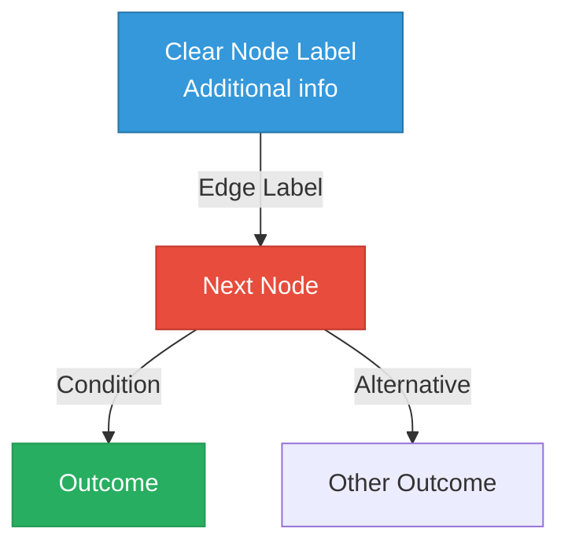

# Diagram Generator for Flashcards

## Purpose

Generates publication-quality diagrams optimized for educational flashcards in the Artifact Foundry. Automatically selects the best visualization tool (Python matplotlib or Mermaid) based on the type of diagram needed.

## When to Use This Skill

Activate this skill when:
- Creating new flashcards that need visual aids
- Replacing ASCII art with professional diagrams
- Adding visual explanations to complex concepts
- Improving existing flashcard visualizations
- User mentions: "add diagram", "visualize", "create chart", "draw", "illustrate"

## Tool Selection Decision Tree

### Use Python (matplotlib) When:

**Data Visualizations**
- Bar charts, histograms, scatter plots
- Line graphs, function curves
- Distribution plots (normal, binomial, etc.)
- Statistical diagrams (CDF, PDF, power curves)

**Scientific/Mathematical Plots**
- Function curves with annotations
- Coordinate systems with transformations
- Side-by-side comparisons
- Heat maps, confusion matrices

**Complex Custom Graphics**
- Venn diagrams with overlapping regions
- Probability spaces with shaded areas
- Conditional probability visualizations
- Any diagram requiring precise positioning/styling

**Learning-Friendly Features Needed**
- Mathematical formulas in labels
- Precise annotations and arrows
- Color-coded regions with legends
- Professional publication quality

### Use Mermaid When:

**Flow and Process Diagrams**
- Algorithm flowcharts
- Decision trees (logical, not ML trees)
- Pipeline diagrams
- Step-by-step processes

**Relationship Diagrams**
- Graph structures (nodes and edges)
- Network diagrams
- Dependency graphs
- State machines

**Conceptual Hierarchies**
- Tree structures (abstract representation)
- Class hierarchies
- Organizational structures
- Taxonomy diagrams

**Advantages**
- Text-based (version control friendly)
- No rendering step needed
- Easy to edit inline in markdown
- Renders in GitHub/VSCode
- Lower barrier for user modifications

## Implementation Standards

### Python (matplotlib) Pattern

```python
"""
Brief description of what this diagram illustrates.
Educational purpose: [explain the concept being visualized]
"""

import numpy as np
import matplotlib.pyplot as plt
from scipy import stats  # if needed

# 1. Setup figure with consistent sizing
fig, ax = plt.subplots(figsize=(10, 6))

# 2. Generate/plot data with clear variable names
x = np.linspace(start, end, points)
y = function(x)

# 3. Style for educational clarity
ax.plot(x, y, linewidth=2.5, color='#3498DB', label='Descriptive Label')
ax.fill_between(x, y, alpha=0.3, color='#3498DB')

# 4. Clear labels and annotations
ax.set_xlabel('X Label (units)', fontsize=12, fontweight='bold')
ax.set_ylabel('Y Label (units)', fontsize=12, fontweight='bold')
ax.set_title('Clear, Educational Title', fontsize=14, fontweight='bold', pad=15)

# 5. Add educational annotations
ax.annotate('Key Point',
           xy=(x_point, y_point),
           xytext=(x_text, y_text),
           arrowprops=dict(arrowstyle='->', lw=2, color='#E74C3C'),
           fontsize=11, fontweight='bold')

# 6. Grid for readability
ax.grid(True, alpha=0.3, linestyle='-', linewidth=0.5)

# 7. Legend if multiple elements
ax.legend(loc='best', fontsize=10)

# 8. Save with high quality
plt.tight_layout()
fig.savefig(output_path, dpi=300, bbox_inches='tight', facecolor='white')
plt.close()

print(f"✓ Diagram saved to: {output_path}")
```

### Mermaid Pattern

````markdown

````

**Mermaid Diagram Types:**
- `graph TD` - Top-down flowchart
- `graph LR` - Left-right flowchart
- `graph TB` - Top-bottom (alias for TD)
- `flowchart` - More features than graph
- `sequenceDiagram` - Sequence diagrams
- `classDiagram` - UML class diagrams
- `stateDiagram` - State machines

## Color Palette (Colorblind-Friendly)

Use these consistent colors across all diagrams:

```python
COLORS = {
    'primary_blue': '#3498DB',    # Main elements
    'primary_red': '#E74C3C',     # Contrasting elements
    'primary_green': '#27AE60',   # Positive/success
    'primary_orange': '#F39C12',  # Warning/attention
    'primary_purple': '#9B59B6',  # Special cases

    'secondary_blue': '#2874A6',   # Darker shades for borders
    'secondary_red': '#C0392B',
    'secondary_green': '#229954',
    'secondary_orange': '#E67E22',
    'secondary_purple': '#8E44AD',
}
```

## File Organization

### Directory Structure

```
interview-prep/flashcards/
├── probability.md
├── statistics.md
└── assets/
    ├── venn_general.png
    ├── pmf_pdf_comparison.png
    └── bayesian_updating.png (from Mermaid)

foundations/snippets/statistics/
├── venn_diagram_generator.py
├── distribution_visualizer.py
└── conditional_probability_visualizer.py
```

### Naming Conventions

**Python-generated PNGs:**
```
[concept]_[diagram_type].png

Examples:
- venn_general.png
- pmf_pdf_comparison.png
- power_curve.png
- variance_comparison.png
```

**Python scripts in foundations:**
```
[concept]_[tool_type].py

Examples:
- venn_diagram_generator.py
- distribution_visualizer.py
- random_variable_visualizer.py
```

## Best Practices for Educational Diagrams

### 1. Clarity First
- Large, readable fonts (title: 14pt, labels: 12pt)
- High contrast colors
- Sufficient whitespace
- Minimal text (let flashcard explain)

### 2. Consistency
- Same figsize for related diagrams: `(10, 6)` for comparisons, `(8, 8)` for single focus
- Consistent color scheme across topic
- Same DPI: 300 for all saved figures

### 3. Educational Value
- Show structure/relationships, not just data
- Include key formulas where relevant
- Annotate important points
- Use visual hierarchy (size, color, position)

### 4. Accessibility
- Colorblind-friendly palettes
- Not relying solely on color for information
- Clear labels (not just colors)
- High contrast (not pastel colors)

### 5. Version Control Friendly
- Prefer Mermaid for simple diagrams (text-based)
- Keep Python scripts for complex visualizations
- Comment generation code thoroughly
- Make diagrams reproducible

## Common Diagram Patterns by Topic

### Probability Flashcards

**Mermaid:**
- Bayes theorem flowcharts
- Decision trees for probability rules
- Frequency trees for medical testing

**Python:**
- Venn diagrams (overlapping circles)
- Probability distributions (PMF, PDF, CDF)
- Conditional probability (sample space restriction)

### Statistics Flashcards

**Python:**
- Hypothesis testing (distributions, critical regions)
- Power curves
- Confidence intervals
- Test statistic distributions

**Mermaid:**
- Statistical test selection flowcharts
- Analysis decision trees

### Machine Learning Flashcards

**Mermaid:**
- Model architectures (high-level)
- Training pipelines
- Cross-validation schemes

**Python:**
- Loss functions and optimization
- Decision boundaries
- Learning curves
- Confusion matrices
- ROC curves

### Algorithms Flashcards

**Mermaid:**
- Algorithm flowcharts
- Recursion trees
- State machines

**Python:**
- Time complexity comparisons (bar charts)
- Space-time tradeoffs (scatter plots)

## Integration with Existing Tools

This skill leverages existing visualization tools in:
- `foundations/snippets/statistics/` - Reusable visualization functions
- Can import and use functions from these modules
- Builds on established patterns

## Error Handling

When generating diagrams:

1. **Test locally first** - Run Python scripts to verify they work
2. **Check dependencies** - Ensure matplotlib, scipy, numpy available
3. **Validate Mermaid syntax** - Use VSCode preview or GitHub rendering
4. **Verify paths** - Ensure assets/ directory exists
5. **Report issues clearly** - If generation fails, explain what went wrong

## Examples Reference

See `examples.md` in this skill directory for:
- Complete working examples for common diagram types
- Template code for quick starts
- Before/after comparisons (ASCII → Professional)

## Workflow

When user requests a diagram:

1. **Analyze the concept** - What needs to be visualized?
2. **Choose tool** - Apply decision tree (Python vs Mermaid)
3. **Check for existing patterns** - Review examples.md
4. **Generate diagram** - Use appropriate pattern
5. **Save appropriately**:
   - Mermaid: Embed directly in flashcard markdown
   - Python: Save PNG to assets/, create reusable script in foundations/
6. **Update flashcard** - Replace ASCII/old diagram with new one
7. **Verify rendering** - Ensure it displays correctly

## Success Criteria

A good flashcard diagram:
- ✓ Immediately understandable without explanation
- ✓ Enhances learning (not just decoration)
- ✓ Follows accessibility guidelines
- ✓ Matches quality of other diagrams in the set
- ✓ Uses appropriate tool for the concept
- ✓ Is reproducible (code available or Mermaid text)
