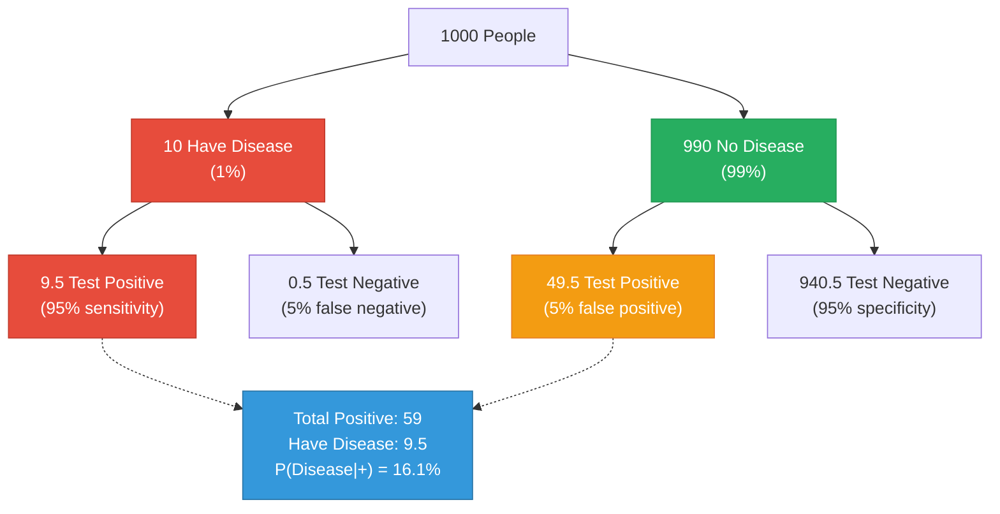
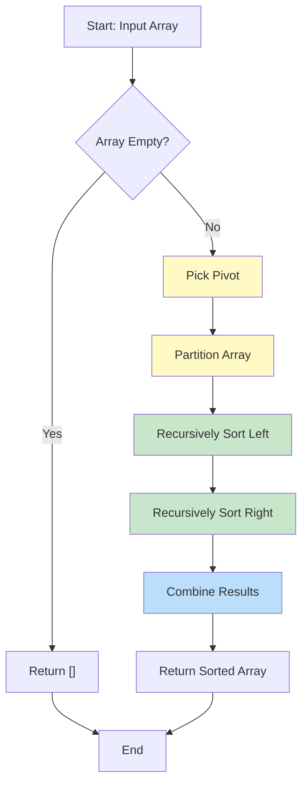
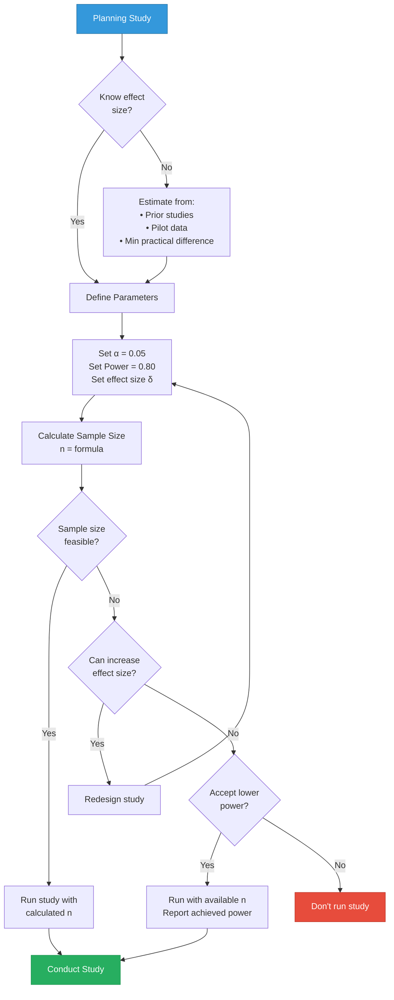
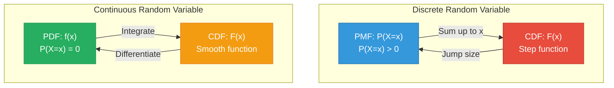

## Diagram Generation Examples

Practical examples for common flashcard diagram types. Use these as templates and adapt for your specific needs.

## Table of Contents

1. [Python Examples](#python-examples)
   - Probability Distributions
   - Comparisons
   - Statistical Concepts
2. [Mermaid Examples](#mermaid-examples)
   - Flowcharts
   - Decision Trees
   - Process Diagrams
3. [Before/After Examples](#beforeafter-examples)

---

## Python Examples

### Example 1: Side-by-Side Distribution Comparison

**Use case:** Comparing discrete PMF vs continuous PDF

```python
"""
PMF vs PDF Comparison
Shows difference between discrete and continuous random variables.
"""
import numpy as np
import matplotlib.pyplot as plt
from scipy import stats

fig, (ax1, ax2) = plt.subplots(1, 2, figsize=(14, 6))

# Left: Discrete PMF (Binomial)
n, p = 10, 0.4
x_discrete = np.arange(0, n+1)
pmf = stats.binom.pmf(x_discrete, n, p)

ax1.bar(x_discrete, pmf, width=0.6, color='#3498DB',
        alpha=0.7, edgecolor='#2874A6', linewidth=2)
ax1.set_xlabel('Value (X)', fontsize=12, fontweight='bold')
ax1.set_ylabel('Probability P(X = x)', fontsize=12, fontweight='bold')
ax1.set_title('Discrete: PMF\nBinomial(n=10, p=0.4)',
              fontsize=13, fontweight='bold', pad=15)
ax1.grid(True, alpha=0.3, axis='y')

# Right: Continuous PDF (Normal)
x_continuous = np.linspace(-4, 4, 1000)
pdf = stats.norm.pdf(x_continuous, 0, 1)

ax2.plot(x_continuous, pdf, linewidth=2.5, color='#E74C3C')
ax2.fill_between(x_continuous, pdf, alpha=0.3, color='#E74C3C')
ax2.set_xlabel('Value (x)', fontsize=12, fontweight='bold')
ax2.set_ylabel('Probability Density f(x)', fontsize=12, fontweight='bold')
ax2.set_title('Continuous: PDF\nNormal(μ=0, σ=1)',
              fontsize=13, fontweight='bold', pad=15)
ax2.grid(True, alpha=0.3, axis='y')

fig.suptitle('Random Variables: Discrete vs Continuous',
             fontsize=16, fontweight='bold', y=0.98)

plt.tight_layout(rect=[0, 0, 1, 0.96])
fig.savefig('pmf_pdf_comparison.png', dpi=300, bbox_inches='tight', facecolor='white')
plt.close()
```

### Example 2: Variance Comparison

**Use case:** Illustrating effect of variance on distribution shape

```python
"""
Variance Comparison
Shows how variance affects spread of distribution.
"""
import numpy as np
import matplotlib.pyplot as plt
from scipy import stats

fig, (ax1, ax2) = plt.subplots(1, 2, figsize=(14, 6))

x = np.linspace(-6, 6, 1000)

# Left: Small variance
mean, std_small = 0, 0.5
y_small = stats.norm.pdf(x, mean, std_small)

ax1.plot(x, y_small, linewidth=2.5, color='#3498DB')
ax1.fill_between(x, y_small, alpha=0.3, color='#3498DB')
ax1.axvline(mean, color='#E74C3C', linestyle='--', linewidth=2, label='Mean')
ax1.set_xlabel('Value', fontsize=12, fontweight='bold')
ax1.set_ylabel('Probability Density', fontsize=12, fontweight='bold')
ax1.set_title(f'Small Variance (σ²={std_small**2:.2f})',
              fontsize=13, fontweight='bold', pad=15)
ax1.grid(True, alpha=0.3)
ax1.legend()

# Add text box
ax1.text(0.98, 0.97, 'Concentrated\nLow uncertainty\nMore predictable',
         transform=ax1.transAxes, fontsize=10, va='top', ha='right',
         bbox=dict(boxstyle='round', facecolor='wheat', alpha=0.5))

# Right: Large variance
std_large = 1.5
y_large = stats.norm.pdf(x, mean, std_large)

ax2.plot(x, y_large, linewidth=2.5, color='#E74C3C')
ax2.fill_between(x, y_large, alpha=0.3, color='#E74C3C')
ax2.axvline(mean, color='#3498DB', linestyle='--', linewidth=2, label='Mean')
ax2.set_xlabel('Value', fontsize=12, fontweight='bold')
ax2.set_ylabel('Probability Density', fontsize=12, fontweight='bold')
ax2.set_title(f'Large Variance (σ²={std_large**2:.2f})',
              fontsize=13, fontweight='bold', pad=15)
ax2.grid(True, alpha=0.3)
ax2.legend()

ax2.text(0.98, 0.97, 'Spread out\nHigh uncertainty\nLess predictable',
         transform=ax2.transAxes, fontsize=10, va='top', ha='right',
         bbox=dict(boxstyle='round', facecolor='wheat', alpha=0.5))

fig.suptitle('Variance Comparison: Same Mean, Different Spread',
             fontsize=16, fontweight='bold', y=0.98)

plt.tight_layout(rect=[0, 0, 1, 0.96])
fig.savefig('variance_comparison.png', dpi=300, bbox_inches='tight', facecolor='white')
plt.close()
```

### Example 3: Venn Diagram

**Use case:** Set operations, probability concepts

```python
"""
Venn Diagram for Set Operations
Shows intersection and union of events.
"""
import matplotlib.pyplot as plt
import matplotlib.patches as patches

fig, ax = plt.subplots(figsize=(10, 8))

ax.set_xlim(0, 10)
ax.set_ylim(0, 8)
ax.set_aspect('equal')
ax.axis('off')

# Sample space rectangle
rect = patches.Rectangle((0.5, 0.5), 9, 7, linewidth=3,
                         edgecolor='black', facecolor='#ECF0F1', alpha=0.2)
ax.add_patch(rect)
ax.text(9.3, 7.3, 'S', fontsize=18, fontweight='bold')

# Event A (circle)
circle_a = patches.Circle((4, 4), 2.0, linewidth=2.5,
                          edgecolor='#3498DB', facecolor='#3498DB', alpha=0.3)
ax.add_patch(circle_a)

# Event B (circle)
circle_b = patches.Circle((6, 4), 2.0, linewidth=2.5,
                          edgecolor='#E74C3C', facecolor='#E74C3C', alpha=0.3)
ax.add_patch(circle_b)

# Labels
ax.text(2.5, 5.5, 'A', fontsize=22, fontweight='bold', color='#2874A6')
ax.text(7.5, 5.5, 'B', fontsize=22, fontweight='bold', color='#C0392B')
ax.text(5, 4, 'A∩B', fontsize=16, fontweight='bold', color='#7D3C98', ha='center')

# Add formula
ax.text(5, 0.8, 'P(A∪B) = P(A) + P(B) - P(A∩B)',
        fontsize=13, ha='center', fontweight='bold',
        bbox=dict(boxstyle='round', facecolor='yellow', alpha=0.6))

ax.set_title('Venn Diagram: Union and Intersection',
             fontsize=16, fontweight='bold', pad=20)

plt.tight_layout()
fig.savefig('venn_general.png', dpi=300, bbox_inches='tight', facecolor='white')
plt.close()
```

### Example 4: CDF Comparison (Step vs Smooth)

**Use case:** Showing discrete vs continuous CDFs

```python
"""
CDF Comparison: Discrete vs Continuous
Shows staircase function for discrete, smooth curve for continuous.
"""
import numpy as np
import matplotlib.pyplot as plt
from scipy import stats

fig, (ax1, ax2) = plt.subplots(1, 2, figsize=(14, 6))

# Left: Discrete CDF (die roll)
x_die = np.arange(0, 8)
cdf_die = np.array([0, 1/6, 2/6, 3/6, 4/6, 5/6, 1, 1])

for i in range(len(x_die)-1):
    ax1.hlines(cdf_die[i], x_die[i], x_die[i+1], colors='#3498DB', linewidth=3)
    ax1.plot(x_die[i], cdf_die[i], 'o', color='#3498DB', markersize=8)
    if i < len(x_die) - 2:
        ax1.plot(x_die[i+1], cdf_die[i], 'o', color='#3498DB',
                markersize=8, fillstyle='none', markeredgewidth=2)

ax1.set_xlabel('Value (X)', fontsize=12, fontweight='bold')
ax1.set_ylabel('F(x) = P(X ≤ x)', fontsize=12, fontweight='bold')
ax1.set_title('Discrete CDF: Die Roll\nStep Function',
              fontsize=13, fontweight='bold', pad=15)
ax1.set_xlim(-0.5, 7.5)
ax1.set_ylim(-0.05, 1.1)
ax1.grid(True, alpha=0.3)

# Right: Continuous CDF (Normal)
x_continuous = np.linspace(-4, 4, 1000)
cdf_continuous = stats.norm.cdf(x_continuous, 0, 1)

ax2.plot(x_continuous, cdf_continuous, linewidth=3, color='#E74C3C')
ax2.axhline(y=0.5, color='#27AE60', linestyle='--', linewidth=2, alpha=0.7)
ax2.axvline(x=0, color='#27AE60', linestyle='--', linewidth=2, alpha=0.7)

ax2.set_xlabel('Value (x)', fontsize=12, fontweight='bold')
ax2.set_ylabel('F(x) = P(X ≤ x)', fontsize=12, fontweight='bold')
ax2.set_title('Continuous CDF: Normal\nSmooth S-Curve',
              fontsize=13, fontweight='bold', pad=15)
ax2.set_ylim(-0.05, 1.1)
ax2.grid(True, alpha=0.3)

fig.suptitle('Cumulative Distribution Functions',
             fontsize=16, fontweight='bold', y=0.98)

plt.tight_layout(rect=[0, 0, 1, 0.96])
fig.savefig('cdf_comparison.png', dpi=300, bbox_inches='tight', facecolor='white')
plt.close()
```

---

## Mermaid Examples

### Example 5: Bayes Theorem Frequency Tree

**Use case:** Medical testing, Bayes theorem illustration

````markdown

````

### Example 6: Algorithm Flowchart

**Use case:** Quick sort algorithm flow

````markdown

````

### Example 7: Power Analysis Decision Flow

**Use case:** Study planning flowchart

````markdown

````

### Example 8: Relationship Diagram

**Use case:** PMF/PDF to CDF relationships

````markdown

````

---

## Before/After Examples

### Before: ASCII Art Venn Diagram

```
Independent:          Mutually Exclusive:
   ┌───┐                 ┌───┐  ┌───┐
   │ A │╲                │ A │  │ B │
   └───┘ ╲               └───┘  └───┘
        ╲ ┌───┐           No overlap
         ╲│ B │
          └───┘
   Overlap possible      No overlap ever
```

### After: Professional PNG

Generated using Python matplotlib with proper circles, colors, and labels.

**Result:** Clear visual distinction, publication quality, accessible colors.

---

### Before: ASCII Distribution

```
f(x)│    ╱╲
    │   ╱  ╲
    │  ╱    ╲
    │ ╱      ╲
    │╱        ╲___
    └──────────────► x
```

### After: Matplotlib Plot

Clean normal distribution curve with:
- Proper mathematical curve (not ASCII approximation)
- Shaded area to show probability
- Clear labels and grid
- Annotations for key points

---

### Before: ASCII CDF Steps

```
F(x) │
1.0  │           ────────
0.83 │       ────────
0.67 │   ────────
0.50 │ ──────
```

### After: Professional CDF

Proper step function with:
- Closed/open circles showing right-continuity
- Smooth rendering
- Clear axis labels
- Educational annotations

---

## Quick Reference: When to Use Which

| Diagram Type | Tool | Why |
|--------------|------|-----|
| Statistical distributions | Python | Need smooth curves, shading, formulas |
| Venn diagrams | Python | Need overlapping circles, precise regions |
| Flowcharts | Mermaid | Text-based, easy to edit, version control |
| Decision trees (logical) | Mermaid | Hierarchical structure, clear flow |
| Probability trees | Mermaid | Branch structure, conditional paths |
| Learning curves | Python | Plotting data over time |
| Confusion matrix | Python | Heatmap with values |
| Algorithm flow | Mermaid | Step-by-step process |
| Architecture diagram | Mermaid | Component relationships |

---

## Tips for Effective Diagrams

1. **Start simple** - Add complexity only if it aids understanding
2. **Use color meaningfully** - Not just decoration, but to distinguish concepts
3. **Add context** - Brief labels, not full explanations
4. **Test readability** - View at actual flashcard size
5. **Iterate** - First version rarely perfect, refine based on use
6. **Consistency** - Use same style across related flashcards
7. **Accessibility** - Colorblind-safe palette, high contrast

---

## Testing Your Diagram

Before finalizing:

1. **Visual check**: Does it render correctly?
2. **Size check**: Readable at flashcard scale?
3. **Color check**: Distinguishable for colorblind viewers?
4. **Content check**: Self-explanatory without reading full flashcard?
5. **Format check**: PNG saved to correct location / Mermaid renders in markdown?
