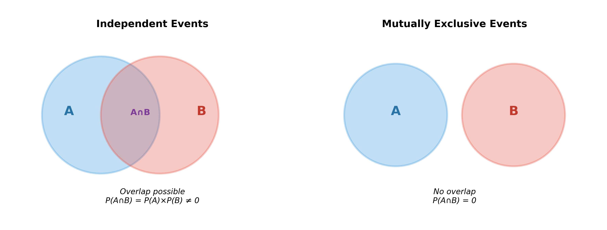
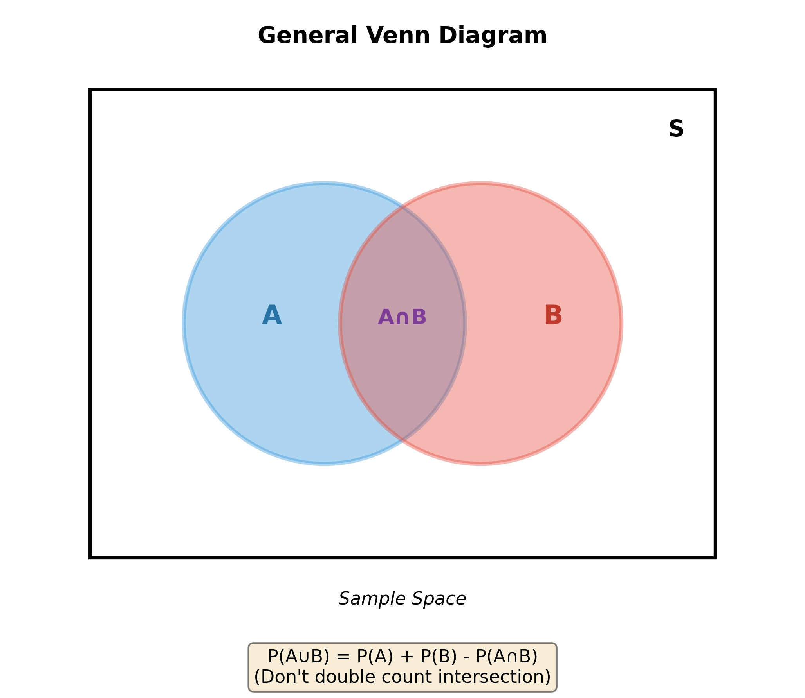
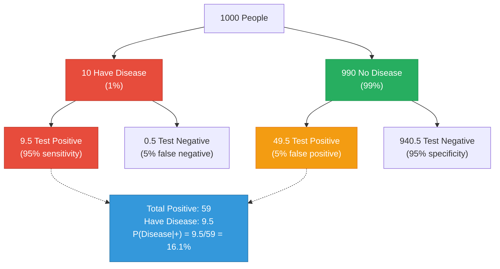
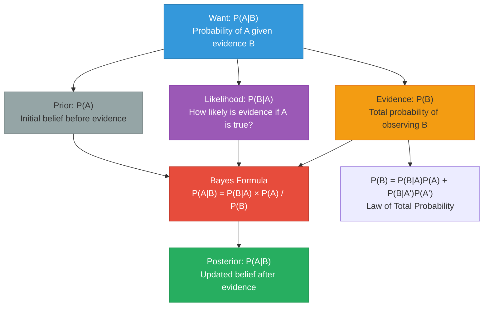
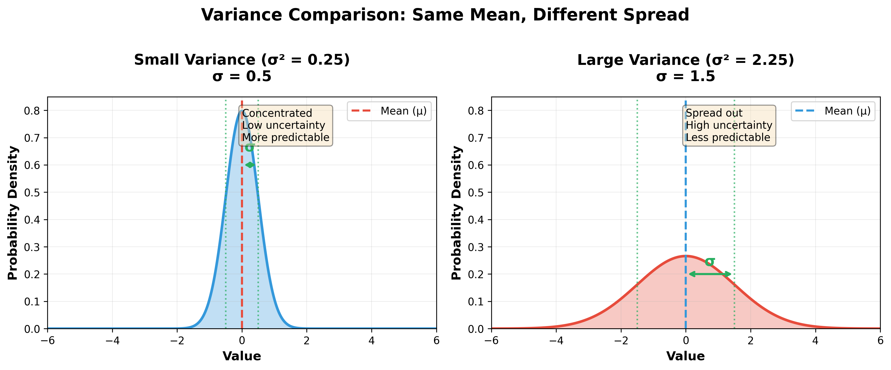
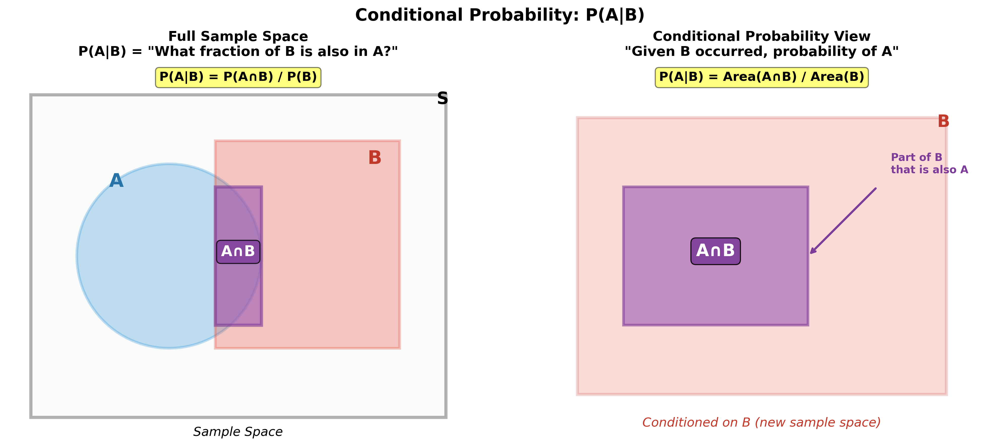
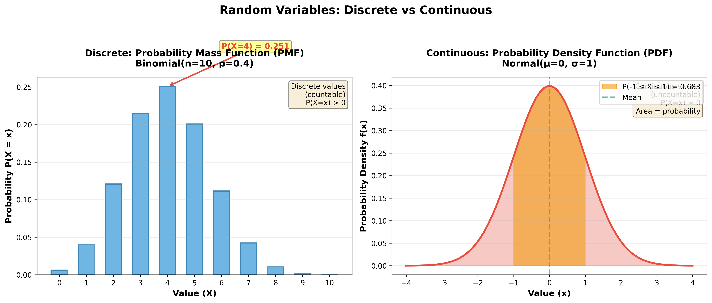
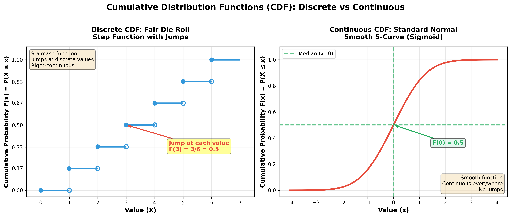
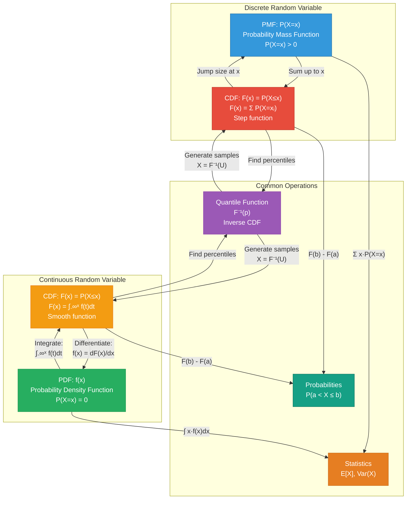

# Probability Flashcards

Covers probability foundations: Bayes theorem, conditional probability, expectations, random variables, and key probability concepts.

## Probability Basics

**Q: What is the difference between independent and mutually exclusive events?**
<details>
<summary>Answer</summary>

Two completely different concepts that are often confused.

**Independent Events:**
```
One event doesn't affect the other's probability

P(A and B) = P(A) × P(B)
P(A|B) = P(A)

Example: Two coin flips
- First flip: Heads
- Second flip: Still 50% heads (not affected)
```

**Mutually Exclusive (Disjoint) Events:**
```
Events cannot happen at the same time

P(A and B) = 0
If A happens, B cannot happen

Example: Single die roll
- Event A: Roll is even {2,4,6}
- Event B: Roll is 5 {5}
- Cannot be both even AND 5
```

**Key difference:**
```
Independent: P(A and B) = P(A) × P(B) ≠ 0
Mutually Exclusive: P(A and B) = 0

If events are mutually exclusive AND have non-zero probability,
they CANNOT be independent!
```

**Venn diagrams:**



**Example comparison:**
```
Deck of cards:

Independent:
- Draw with replacement
- P(First Ace) = 4/52
- P(Second Ace | First Ace) = 4/52 (replaced first card)

NOT Independent:
- Draw without replacement
- P(First Ace) = 4/52
- P(Second Ace | First Ace) = 3/51

Mutually Exclusive:
- P(Card is Heart AND Spade) = 0
- Can't be two suits simultaneously
```

**Common mistake:**
```
"If two events are independent, they must be mutually exclusive"
WRONG! This is backwards thinking

In fact:
- If P(A) > 0 and P(B) > 0
- AND events are mutually exclusive (P(A and B) = 0)
- THEN they CANNOT be independent
  (because P(A)×P(B) > 0, but P(A and B) = 0)
```
</details>

**Q: What are the key probability rules and formulas?**
<details>
<summary>Answer</summary>

Essential rules for working with probabilities.

**1. Basic axioms:**
```
0 ≤ P(A) ≤ 1          (Probabilities between 0 and 1)
P(S) = 1              (Probability of sample space = 1)
P(A or B) = P(A) + P(B)   (if A and B mutually exclusive)
```

**2. Complement rule:**
```
P(A') = 1 - P(A)
P(not A) = 1 - P(A)

Example: P(rain) = 0.3 → P(no rain) = 0.7
```

**3. Addition rule (OR):**
```
General: P(A or B) = P(A) + P(B) - P(A and B)

If mutually exclusive: P(A or B) = P(A) + P(B)

Example: Deck of cards
P(King or Heart) = P(King) + P(Heart) - P(King of Hearts)
                 = 4/52 + 13/52 - 1/52
                 = 16/52
```

**4. Multiplication rule (AND):**
```
General: P(A and B) = P(A) × P(B|A)

If independent: P(A and B) = P(A) × P(B)

Example: Draw 2 cards without replacement
P(Both Aces) = P(First Ace) × P(Second Ace | First Ace)
             = (4/52) × (3/51)
             = 1/221
```

**5. Conditional probability:**
```
P(A|B) = P(A and B) / P(B)

"Probability of A given B has occurred"

Example: P(King | Red card) = P(King and Red) / P(Red)
                              = (2/52) / (26/52)
                              = 2/26 = 1/13
```

**6. Law of Total Probability:**
```
If B₁, B₂, ..., Bₙ partition the sample space:

P(A) = Σ P(A|Bᵢ) × P(Bᵢ)

Example: P(Positive test) = P(+|Disease)×P(Disease) + P(+|No disease)×P(No disease)
```

**7. Bayes' Theorem:**
```
P(A|B) = P(B|A) × P(A) / P(B)

More detailed in separate flashcard
```

**Quick reference table:**

| Rule | Formula | When to Use |
|------|---------|-------------|
| **Complement** | P(A') = 1 - P(A) | Finding "not A" |
| **OR** | P(A∪B) = P(A) + P(B) - P(A∩B) | Either event |
| **AND (independent)** | P(A∩B) = P(A)P(B) | Both events, independent |
| **AND (general)** | P(A∩B) = P(A)P(B\|A) | Both events, any case |
| **Conditional** | P(A\|B) = P(A∩B)/P(B) | Given B occurred |

**Visual (Venn diagram):**


</details>

---

## Bayes' Theorem

**Q: What is Bayes' Theorem and how do you apply it?**
<details>
<summary>Answer</summary>

Formula for updating probabilities based on new evidence. Relates conditional probabilities.

**Formula:**
```
P(A|B) = P(B|A) × P(A) / P(B)

Or more explicitly:
P(A|B) = [P(B|A) × P(A)] / [P(B|A)×P(A) + P(B|A')×P(A')]
```

**Components:**
- **P(A|B):** Posterior probability (what we want)
- **P(B|A):** Likelihood (probability of evidence given hypothesis)
- **P(A):** Prior probability (initial belief)
- **P(B):** Marginal probability (total probability of evidence)

**Intuitive explanation:**
```
"Given new evidence B, how should I update my belief about A?"

Prior × Likelihood = Posterior
     ────────────
      Evidence
```

**Classic example: Medical testing**
```
Disease affects 1% of population
Test is 95% accurate (sensitivity and specificity)
You test positive. What's probability you have disease?

Given:
- P(Disease) = 0.01 (prior)
- P(Positive | Disease) = 0.95 (true positive rate)
- P(Positive | No Disease) = 0.05 (false positive rate)

Find: P(Disease | Positive) = ?

Solution:
P(Disease|+) = P(+|Disease) × P(Disease) / P(+)

P(+) = P(+|Disease)×P(Disease) + P(+|No Disease)×P(No Disease)
     = 0.95 × 0.01 + 0.05 × 0.99
     = 0.0095 + 0.0495
     = 0.059

P(Disease|+) = (0.95 × 0.01) / 0.059
             = 0.0095 / 0.059
             = 0.161 = 16.1%

Only 16.1% chance despite positive test!
(Because disease is rare - low prior)
```

**Why it's counterintuitive:**
People often confuse P(A|B) with P(B|A)

```
P(+|Disease) = 95%  ≠  P(Disease|+) = 16.1%

"If you have disease, 95% chance test is positive"
  IS NOT THE SAME AS
"If test is positive, 95% chance you have disease"
```

**Visualization (frequency tree):**



**Spam filter example:**
```
P(Spam|"viagra") = P("viagra"|Spam) × P(Spam) / P("viagra")

If:
- P("viagra"|Spam) = 0.80 (80% of spam contains "viagra")
- P(Spam) = 0.20 (20% of emails are spam)
- P("viagra") = 0.20 (20% of all emails contain "viagra")

Then:
P(Spam|"viagra") = 0.80 × 0.20 / 0.20 = 0.80 = 80%
```

**Bayesian updating:**

Iterative refinement of beliefs as new evidence arrives.


**Bayes Theorem Components Flow:**



**Common applications:**
- Medical diagnosis
- Spam filtering
- A/B test interpretation
- Machine learning (Naive Bayes)
- Document classification
</details>

**Q: What is the difference between sensitivity and specificity?**
<details>
<summary>Answer</summary>

Two measures of test accuracy that focus on different aspects.

**Sensitivity (True Positive Rate, Recall):**
```
Sensitivity = TP / (TP + FN) = P(Test + | Disease)

"Of those WHO HAVE the condition, what % test positive?"

High sensitivity = Few false negatives = Catches most cases
```

**Specificity (True Negative Rate):**
```
Specificity = TN / (TN + FP) = P(Test - | No Disease)

"Of those WHO DON'T HAVE the condition, what % test negative?"

High specificity = Few false positives = Rarely wrong when says positive
```

**Confusion matrix context:**
```
                   True Condition
                Has Disease  No Disease
Test    Positive     TP          FP
Result  Negative     FN          TN

Sensitivity = TP/(TP+FN)  (focus on disease column)
Specificity = TN/(TN+FP)  (focus on no disease column)
```

**Complementary metrics:**

**Positive Predictive Value (PPV):**
```
PPV = TP / (TP + FP) = P(Disease | Test +)

"If test is positive, what's probability of disease?"
Depends on prevalence (prior probability)
```

**Negative Predictive Value (NPV):**
```
NPV = TN / (TN + FN) = P(No Disease | Test -)

"If test is negative, what's probability of no disease?"
```

**Relationship to Bayes:**
```
PPV uses Bayes' Theorem:
PPV = Sensitivity × Prevalence / [Sensitivity × Prevalence + (1-Specificity) × (1-Prevalence)]
```

**Trade-off:**
```
Sensitivity ↑ → Specificity ↓ (typically)

More sensitive threshold → More positives → More false positives
More specific threshold → Fewer positives → More false negatives

ROC curve shows this trade-off
```

**Example:**
```
Test for rare disease (prevalence = 1%):

Scenario 1: High sensitivity (99%), Low specificity (90%)
- Catches almost all cases (good!)
- But many false alarms (bad if costly)
- PPV = (0.99×0.01) / [(0.99×0.01) + (0.10×0.99)] ≈ 9%

Scenario 2: Lower sensitivity (90%), High specificity (99%)
- Misses some cases (bad for serious disease)
- Very few false alarms (good!)
- PPV = (0.90×0.01) / [(0.90×0.01) + (0.01×0.99)] ≈ 48%
```

**When to prioritize:**

**High sensitivity:**
- ✅ Early screening for serious diseases (cancer, HIV)
- ✅ When false negatives are costly
- ✅ When follow-up test is available

**High specificity:**
- ✅ Confirmatory tests
- ✅ When false positives are costly (invasive treatment)
- ✅ When resources are limited

**Mnemonic:**
```
SnNout: High Sensitivity, Negative result → Rules Out disease
SpPin: High Specificity, Positive result → Rules In disease
```

**Comparison table:**

| Metric | Formula | Focus | Question Answered |
|--------|---------|-------|-------------------|
| **Sensitivity** | TP/(TP+FN) | Disease present | How many cases caught? |
| **Specificity** | TN/(TN+FP) | Disease absent | How many healthy correctly identified? |
| **PPV** | TP/(TP+FP) | Test positive | If +, how likely disease? |
| **NPV** | TN/(TN+FN) | Test negative | If -, how likely healthy? |

**Key insight:**
Sensitivity and specificity are properties of the test (independent of prevalence).
PPV and NPV depend on both test properties AND disease prevalence.
</details>

---

## Expected Value & Variance

**Q: What is expected value and how do you calculate it?**
<details>
<summary>Answer</summary>

Average value of a random variable if experiment repeated many times.

**Discrete random variable:**
```
E[X] = Σ xᵢ × P(X = xᵢ)

Sum over all possible values × their probabilities
```

**Continuous random variable:**
```
E[X] = ∫ x × f(x) dx

Integral of value × probability density
```

**Example 1: Dice roll**
```
X = outcome of fair die
E[X] = 1×(1/6) + 2×(1/6) + 3×(1/6) + 4×(1/6) + 5×(1/6) + 6×(1/6)
     = (1+2+3+4+5+6)/6
     = 21/6 = 3.5

Expected value is 3.5 (impossible to actually roll this!)
```

**Example 2: Unfair coin game**
```
Coin: 60% heads, 40% tails
Win $10 for heads, lose $5 for tails

E[Winnings] = 10×0.6 + (-5)×0.4
            = 6 - 2 = $4

Expected to win $4 per game in long run
```

**Properties of expectation:**

**1. Linearity:**
```
E[aX + b] = aE[X] + b

E[X + Y] = E[X] + E[Y]  (even if not independent!)

Example: E[3X + 5] = 3E[X] + 5
```

**2. Product (if independent):**
```
E[XY] = E[X] × E[Y]  (only if X and Y independent)
```

**3. Function of random variable:**
```
E[g(X)] = Σ g(xᵢ) × P(X = xᵢ)

Note: E[g(X)] ≠ g(E[X]) in general!
Example: E[X²] ≠ (E[X])²
```

**Common expectations:**

| Distribution | E[X] |
|--------------|------|
| Bernoulli(p) | p |
| Binomial(n,p) | np |
| Poisson(λ) | λ |
| Uniform(a,b) | (a+b)/2 |
| Normal(μ,σ²) | μ |
| Exponential(λ) | 1/λ |

**Expected value vs mean:**
```
E[X] = Theoretical average (population mean μ)
x̄ = Sample average (estimate of E[X])

Law of Large Numbers:
As n → ∞, x̄ → E[X]
```

**Decision making:**
```
Choose option with highest expected value?

Not always! Consider:
- Risk aversion
- Variance (spread of outcomes)
- Catastrophic outcomes
- Utility (subjective value)

Example:
Option A: Win $100 for sure
Option B: 60% chance $200, 40% chance $0

E[A] = $100
E[B] = 0.6×$200 + 0.4×$0 = $120

B has higher expected value, but A is guaranteed
Choice depends on risk tolerance
```

**Expected value of function:**
```
Rolling a die, payoff is X²:

E[X²] = 1²×(1/6) + 2²×(1/6) + ... + 6²×(1/6)
      = (1+4+9+16+25+36)/6
      = 91/6 ≈ 15.17

Note: This is NOT (E[X])² = 3.5² = 12.25
Jensen's Inequality: For convex function, E[g(X)] ≥ g(E[X])
```
</details>

**Q: What is variance and how does it relate to standard deviation?**
<details>
<summary>Answer</summary>

Variance measures spread/dispersion of random variable around its mean.

**Definition:**
```
Var(X) = E[(X - μ)²]
       = E[X²] - (E[X])²

Standard Deviation: σ = √Var(X)
```

**Intuition:**
```
Variance = Average squared distance from mean
Std Dev = Typical distance from mean (same units as X)
```

**Calculation (discrete):**
```
Var(X) = Σ (xᵢ - μ)² × P(X = xᵢ)

Or equivalently:
Var(X) = E[X²] - (E[X])²  (computational formula, easier)
```

**Example: Fair die**
```
E[X] = 3.5 (from previous flashcard)

E[X²] = 1²×(1/6) + 2²×(1/6) + ... + 6²×(1/6) = 91/6

Var(X) = 91/6 - (3.5)² = 15.17 - 12.25 = 2.92
SD(X) = √2.92 ≈ 1.71
```

**Properties:**

**1. Adding constants:**
```
Var(X + b) = Var(X)  (shifting doesn't change spread)
```

**2. Multiplying by constants:**
```
Var(aX) = a² Var(X)

SD(aX) = |a| SD(X)
```

**3. Sum of independent variables:**
```
Var(X + Y) = Var(X) + Var(Y)  (only if X, Y independent)

Var(X - Y) = Var(X) + Var(Y)  (variances add even for subtraction!)
```

**4. General sum:**
```
Var(aX + bY) = a²Var(X) + b²Var(Y) + 2abCov(X,Y)

If independent, Cov(X,Y) = 0, so:
Var(aX + bY) = a²Var(X) + b²Var(Y)
```

**Common variances:**

| Distribution | Var(X) |
|--------------|--------|
| Bernoulli(p) | p(1-p) |
| Binomial(n,p) | np(1-p) |
| Poisson(λ) | λ |
| Uniform(a,b) | (b-a)²/12 |
| Normal(μ,σ²) | σ² |
| Exponential(λ) | 1/λ² |

**Coefficient of Variation:**
```
CV = σ/μ (relative variability)

Allows comparison across different scales
Example: Heights (cm) vs weights (kg)
```

**Why variance is squared:**
```
If we used E[|X - μ|] instead:
- Less mathematically tractable
- No nice properties (like Var(X+Y) = Var(X) + Var(Y))
- Harder to work with in calculus

Squaring:
- Penalizes large deviations more
- Has nice mathematical properties
- Related to least squares optimization
```

**Sample vs Population:**
```
Population: Var(X) = E[(X-μ)²]
Sample: s² = Σ(xᵢ - x̄)² / (n-1)

Note: n-1 (not n) for unbiased estimate
```

**Visual interpretation:**



**Relationship to prediction:**
```
Higher variance → Less predictable
Lower variance → More predictable

Variance represents uncertainty
```
</details>

---

## Conditional Probability

**Q: What is conditional probability and how do you calculate it?**
<details>
<summary>Answer</summary>

Probability of event A given that event B has occurred.

**Formula:**
```
P(A|B) = P(A and B) / P(B)

Provided P(B) > 0
```

**Intuition:**
```
"Restrict sample space to B, then find probability of A within that"

Think: "Among all outcomes where B happened, what fraction has A?"
```

**Example 1: Cards**
```
Standard deck (52 cards)
B = Card is red (26 cards)
A = Card is King (4 cards)
A ∩ B = Red King (2 cards)

P(King | Red) = P(King and Red) / P(Red)
              = (2/52) / (26/52)
              = 2/26 = 1/13

Intuition: Of 26 red cards, 2 are Kings
```

**Example 2: Two children problem**
```
Family has 2 children, at least one is a boy
What's probability both are boys?

Sample space given "at least one boy": {BB, BG, GB}
(Excludes GG)

P(Both boys | At least one boy) = P(BB) / P(At least one boy)
                                 = (1/4) / (3/4)
                                 = 1/3

Not 1/2! (Common mistake)
```

**Multiplication rule (rearranged):**
```
P(A and B) = P(A|B) × P(B)
           = P(B|A) × P(A)

Useful for calculating joint probabilities
```

**Chain rule (multiple events):**
```
P(A₁ ∩ A₂ ∩ ... ∩ Aₙ) = P(A₁) × P(A₂|A₁) × P(A₃|A₁,A₂) × ... × P(Aₙ|A₁,...,Aₙ₋₁)

Example: Draw 3 aces without replacement
P(All 3 aces) = (4/52) × (3/51) × (2/50)
```

**Independence test:**
```
A and B are independent if and only if:
P(A|B) = P(A)

Or equivalently:
P(A and B) = P(A) × P(B)

If A and B independent, B gives no information about A
```

**Conditional probability table:**
```
Example: Disease and symptoms

                Has Symptom    No Symptom    Total
Has Disease         0.08          0.02       0.10
No Disease          0.18          0.72       0.90
Total               0.26          0.74       1.00

P(Disease | Symptom) = 0.08 / 0.26 ≈ 0.31 = 31%
P(Disease | No Symptom) = 0.02 / 0.74 ≈ 0.03 = 3%
```

**Common patterns:**

**1. Partition and condition:**
```
If B₁, B₂, ..., Bₙ partition the space:
P(A) = Σ P(A|Bᵢ) × P(Bᵢ)
```

**2. Reverse conditioning (Bayes):**
```
P(A|B) = P(B|A) × P(A) / P(B)
```

**Visualization:**



*Left: Full sample space showing A, B, and their intersection. Right: When conditioning on B, B becomes the new sample space, and we ask what fraction of B is also in A.*

**Conditional probability trees:**
```
                  0.6
           ┌──────────► A
      0.7  │
    ───────┤
           │  0.4
           └──────────► A'

      0.3  │  0.8
    ───────┼──────────► A
           │
           │  0.2
           └──────────► A'

P(A) = 0.7×0.6 + 0.3×0.8 = 0.42 + 0.24 = 0.66
```
</details>

---

## Random Variables

**Q: What is the difference between discrete and continuous random variables?**
<details>
<summary>Answer</summary>

Random variables map outcomes to numbers. Two main types based on possible values.

**Discrete Random Variable:**
```
Takes countable values (often integers)
Can list all possible values

Probability Mass Function (PMF):
P(X = x) for each possible value x
Σ P(X = xᵢ) = 1
```

**Examples:**
- Number of coin flips until first heads {1, 2, 3, ...}
- Number of customer arrivals in an hour {0, 1, 2, ...}
- Outcome of die roll {1, 2, 3, 4, 5, 6}
- Number of defective items in batch {0, 1, ..., n}

**Continuous Random Variable:**
```
Takes uncountably infinite values in an interval
Cannot list all values

Probability Density Function (PDF):
f(x) where ∫ f(x)dx = 1
P(X = specific value) = 0 (!)
P(a ≤ X ≤ b) = ∫ₐᵇ f(x)dx
```

**Examples:**
- Height of a person (can be any value in range)
- Time until next event
- Temperature
- Measurement error

**Key differences:**

| Aspect | Discrete | Continuous |
|--------|----------|------------|
| **Values** | Countable | Uncountable |
| **Function** | PMF: P(X=x) | PDF: f(x) |
| **Point probability** | Can be > 0 | Always 0 |
| **Summation** | Σ P(X=xᵢ) = 1 | ∫ f(x)dx = 1 |
| **Cumulative** | P(X ≤ x) = Σ P(X=xᵢ) | P(X ≤ x) = ∫ f(t)dt |
| **Example** | Binomial, Poisson | Normal, Exponential |

**Probability interpretation:**

**Discrete:**
```
P(X = 3) = 0.25
"Probability of exactly 3 is 25%"
```

**Continuous:**
```
P(X = 3) = 0 (!)
"Probability of exactly 3.000... is 0"

Instead:
P(2.5 ≤ X ≤ 3.5) = 0.25
"Probability in interval is 25%"
```

**Why P(X = x) = 0 for continuous?**
```
Infinitely many values in any interval
Probability "spread" over infinite points
Any single point has 0 probability

But: f(x) ≠ P(X=x)
f(x) is density (height of PDF), not probability
```

**Visual:**



*Left: Discrete PMF shows probabilities as bars for countable values. Right: Continuous PDF shows density as a smooth curve where area represents probability.*

**Cumulative Distribution Function (CDF):**
Both have CDF: F(x) = P(X ≤ x)

**Discrete:**
```
F(x) = Σ P(X = xᵢ) for all xᵢ ≤ x

Step function (jumps at each value)
```

**Continuous:**
```
F(x) = ∫₋∞ˣ f(t) dt

Smooth increasing function
f(x) = dF(x)/dx (PDF is derivative of CDF)
```

**Converting between:**
```
Can "discretize" continuous:
- Round measurements
- Group into bins

Can approximate discrete as continuous:
- When many possible values
- Binomial → Normal (n large)
```

**Expected value notation:**

**Discrete:**
```
E[X] = Σ xᵢ P(X = xᵢ)
```

**Continuous:**
```
E[X] = ∫ x f(x) dx
```

**Practical tip:**
```
If you can count possible values → Discrete
If you need to measure precisely → Continuous
```
</details>

**Q: What is a cumulative distribution function (CDF)?**
<details>
<summary>Answer</summary>

Function giving probability that random variable is less than or equal to a value.

**Definition:**
```
F(x) = P(X ≤ x)

"Cumulative" because it accumulates probability up to x
```

**Properties:**

**1. Range:**
```
0 ≤ F(x) ≤ 1 for all x
```

**2. Monotonicity:**
```
If x₁ < x₂, then F(x₁) ≤ F(x₂)
(Non-decreasing function)
```

**3. Limits:**
```
lim[x→-∞] F(x) = 0
lim[x→∞] F(x) = 1
```

**4. Right-continuous:**
```
lim[x→a⁺] F(x) = F(a)
```

**Discrete vs Continuous:**

**Discrete:**
```
F(x) = Σ P(X = xᵢ) for all xᵢ ≤ x
     xᵢ≤x

Example: Die roll
F(3) = P(X≤3) = P(X=1) + P(X=2) + P(X=3)
     = 1/6 + 1/6 + 1/6 = 3/6 = 0.5

Step function with jumps
```

**Continuous:**
```
F(x) = ∫₋∞ˣ f(t) dt

f(x) = dF(x)/dx  (PDF is derivative of CDF)

Example: Uniform(0,1)
F(x) = { 0    if x < 0
       { x    if 0 ≤ x ≤ 1
       { 1    if x > 1
```

**Using CDF to find probabilities:**

**1. P(X ≤ a):**
```
P(X ≤ a) = F(a)
```

**2. P(X > a):**
```
P(X > a) = 1 - F(a)
```

**3. P(a < X ≤ b):**
```
P(a < X ≤ b) = F(b) - F(a)
```

**4. P(X = a) (discrete only):**
```
P(X = a) = F(a) - lim[x→a⁻] F(x)
         = size of jump at a
```

**Visual:**



*Left: Discrete CDF shows step function with jumps at each value. Right: Continuous CDF shows smooth sigmoid curve with no jumps.*

**Standard Normal CDF:**
```
Φ(z) = P(Z ≤ z) where Z ~ N(0,1)

Special notation, values in tables
Example: Φ(1.96) ≈ 0.975
```

**Inverse CDF (Quantile function):**
```
F⁻¹(p) = smallest x such that F(x) ≥ p

Also called: Quantile function, Percent point function

Example: Normal
F⁻¹(0.975) = 1.96
"97.5th percentile is 1.96 standard deviations above mean"

Used for:
- Generating random samples
- Finding confidence interval bounds
- Percentile calculations
```

**Percentiles from CDF:**
```
25th percentile: F⁻¹(0.25)
Median: F⁻¹(0.50)
75th percentile: F⁻¹(0.75)

Example: F⁻¹(0.95) gives value x where P(X ≤ x) = 0.95
```

**Applications:**

**1. Hypothesis testing:**
```
Find critical value: F⁻¹(1-α)
Calculate p-value: 1 - F(test_statistic)
```

**2. Confidence intervals:**
```
Find z_α/2: F⁻¹(1 - α/2)
```

**3. Random sampling:**
```
Generate U ~ Uniform(0,1)
X = F⁻¹(U) has CDF F
(Inverse transform sampling)
```

**Relationship summary:**



*Key relationships between probability functions and their uses.*
</details>
