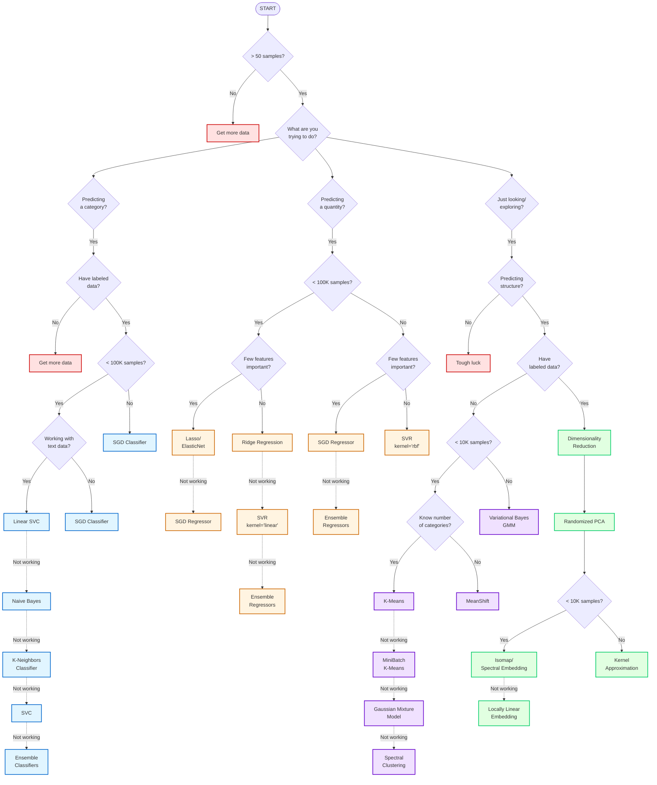

# Classical Machine Learning Cheatsheet

> Comprehensive reference for classical ML algorithms, theory, and best practices
> Based on Stanford CS-229 course materials

## Table of Contents
1. [Fundamentals](#fundamentals)
2. [Supervised Learning](#supervised-learning)
3. [Unsupervised Learning](#unsupervised-learning)
4. [Model Evaluation & Selection](#model-evaluation--selection)
5. [Learning Theory](#learning-theory)
6. [Regularization & Optimization](#regularization--optimization)
7. [Bias-Variance Tradeoff](#bias-variance-tradeoff)
8. [Algorithm Selection Guide](#algorithm-selection-guide)
   - [Scikit-Learn Flowchart](#scikit-learn-algorithm-selection-flowchart)

---

## Fundamentals

### Core Concepts

**Supervised Learning**: Build predictors using labeled training data `{x^(1), ..., x^(m)}` paired with `{y^(1), ..., y^(m)}`
- **Regression**: Continuous outcomes
- **Classification**: Discrete class predictions

**Unsupervised Learning**: Find hidden patterns in unlabeled data `{x^(1), ..., x^(m)}`

**Model Types**:
- **Discriminative Models**: Directly estimate `P(y|x)` - learn decision boundaries
- **Generative Models**: Estimate `P(x|y)` and use Bayes' rule - learn probability distributions

### Key Notation

| Symbol | Meaning |
|--------|---------|
| `m` | Number of training examples |
| `n` | Number of features |
| `x^(i)` | i-th training input |
| `y^(i)` | i-th training output |
| `h_θ(x)` | Hypothesis function |
| `θ` | Model parameters |
| `α` | Learning rate |

### Loss Functions

| Loss Function | Formula | Use Case |
|---------------|---------|----------|
| **Least Squared Error** | $\frac{1}{2}(y-z)^2$ | Linear regression |
| **Logistic Loss** | $\log(1+\exp(-yz))$ | Logistic regression |
| **Hinge Loss** | $\max(0, 1-yz)$ | SVM |
| **Cross-Entropy** | $-[y\log(z) + (1-y)\log(1-z)]$ | Neural networks |

**Cost Function**: $J(\theta) = \sum_{i=1}^m L(h_\theta(x^{(i)}), y^{(i)})$

### Optimization Algorithms

**Gradient Descent**: $\theta \leftarrow \theta - \alpha \nabla J(\theta)$

**Newton's Method**: $\theta \leftarrow \theta - \frac{\ell'(\theta)}{\ell''(\theta)}$
- Faster convergence but requires computing Hessian

**Likelihood Maximization**: $\theta^{\text{opt}} = \arg\max_\theta L(\theta)$

### Important Inequalities

**Jensen's Inequality**: For convex function $f$ and random variable $X$:

$$\mathbb{E}[f(X)] \geq f(\mathbb{E}[X])$$

**Union Bound**: $P(A_1 \cup \cdots \cup A_k) \leq P(A_1) + \cdots + P(A_k)$

**Hoeffding Inequality**: For $m$ i.i.d. Bernoulli variables with parameter $\phi$:

$$P(|\phi - \hat{\phi}| > \gamma) \leq 2\exp(-2\gamma^2 m)$$

---

## Supervised Learning

### Linear Regression

**Assumption**: $y|x;\theta \sim \mathcal{N}(\mu, \sigma^2)$

**Hypothesis**: $h_\theta(x) = \theta^T x$

**Normal Equations** (closed-form solution):

$$\theta = (X^T X)^{-1} X^T y$$

**LMS Algorithm** (Widrow-Hoff rule):

$$\forall j: \theta_j \leftarrow \theta_j + \alpha \sum_{i=1}^m [y^{(i)} - h_\theta(x^{(i)})] x_j^{(i)}$$

**Locally Weighted Regression (LWR)**:
- Weight training examples: $w^{(i)}(x) = \exp\left(-\frac{\|x^{(i)} - x\|^2}{2\tau^2}\right)$
- $\tau$: bandwidth parameter controlling locality

**Pros/Cons**:
- ✅ Simple, interpretable, closed-form solution
- ✅ Works well with linear relationships
- ❌ Assumes linearity
- ❌ Sensitive to outliers

---

### Logistic Regression

**Sigmoid Function**:

$$g(z) = \frac{1}{1 + e^{-z}} \in (0,1)$$

**Model**: $P(y=1|x;\theta) = \phi = g(\theta^T x)$

**Assumption**: $y|x;\theta \sim \text{Bernoulli}(\phi)$

**Decision Boundary**: $\theta^T x = 0$

**No closed-form solution** - use gradient descent or Newton's method

**Softmax Regression** (multiclass):

$$\phi_i = \frac{\exp(\theta_i^T x)}{\sum_{j=1}^K \exp(\theta_j^T x)}$$

**Pros/Cons**:
- ✅ Probabilistic output
- ✅ Works well for binary/multiclass
- ✅ Less prone to outliers than linear regression
- ❌ Assumes linear decision boundary
- ❌ Can underfit complex relationships

---

### Generalized Linear Models (GLM)

**Exponential Family Distribution**:

$$p(y;\eta) = b(y) \exp(\eta T(y) - a(\eta))$$

Where:
- $\eta$: natural parameter
- $T(y)$: sufficient statistic
- $a(\eta)$: log partition function
- $b(y)$: base measure

**Common Distributions**:

| Distribution | $\eta$ | $T(y)$ | $a(\eta)$ |
|--------------|---|------|------|
| **Bernoulli** | $\log\left(\frac{\phi}{1-\phi}\right)$ | $y$ | $\log(1+\exp(\eta))$ |
| **Gaussian** | $\mu$ | $y$ | $\frac{\eta^2}{2}$ |
| **Poisson** | $\log(\lambda)$ | $y$ | $e^\eta$ |

**GLM Assumptions**:
1. $y|x;\theta \sim \text{ExpFamily}(\eta)$
2. $h_\theta(x) = \mathbb{E}[y|x;\theta]$
3. $\eta = \theta^T x$ (linear in parameters)

**Applications**:
- Bernoulli → Logistic regression
- Gaussian → Linear regression
- Poisson → Count data modeling

---

### Support Vector Machines (SVM)

**Goal**: Maximize margin (minimum distance to decision boundary)

**Decision Function**: $h(x) = \text{sign}(w^T x - b)$

**Optimization Problem**:

$$\min \frac{1}{2}\|w\|^2 \quad \text{subject to: } y^{(i)}(w^T x^{(i)} - b) \geq 1, \forall i$$

**Decision Boundary**: $w^T x - b = 0$

**Margin**: $\frac{2}{\|w\|}$

**Hinge Loss**: $L(z,y) = \max(0, 1-yz) = [1-yz]_+$

**Soft-Margin SVM** (with slack variables):

$$\min \frac{1}{2}\|w\|^2 + C\sum_i \xi_i \quad \text{subject to: } y^{(i)}(w^T x^{(i)} - b) \geq 1 - \xi_i, \xi_i \geq 0$$

**Kernels**: $K(x,z) = \phi(x)^T \phi(z)$

Common kernels:
- **Linear**: $K(x,z) = x^T z$
- **Polynomial**: $K(x,z) = (x^T z + c)^d$
- **Gaussian (RBF)**: $K(x,z) = \exp\left(-\frac{\|x-z\|^2}{2\sigma^2}\right)$
- **Sigmoid**: $K(x,z) = \tanh(\kappa x^T z + c)$

**Lagrangian Formulation**:

$$\mathcal{L}(w,b,\alpha) = \frac{1}{2}\|w\|^2 - \sum_i \alpha_i[y^{(i)}(w^T x^{(i)} - b) - 1]$$

**Dual Problem**:

$$\max \sum_i \alpha_i - \frac{1}{2}\sum_i\sum_j \alpha_i \alpha_j y^{(i)} y^{(j)} K(x^{(i)}, x^{(j)}) \quad \text{subject to: } 0 \leq \alpha_i \leq C, \sum_i \alpha_i y^{(i)} = 0$$

**Pros/Cons**:
- ✅ Effective in high dimensions
- ✅ Works well with clear margin of separation
- ✅ Kernel trick enables non-linear boundaries
- ✅ Memory efficient (uses subset of training points)
- ❌ Computationally expensive for large datasets
- ❌ Sensitive to noise and overlapping classes
- ❌ No probabilistic output

---

### Gaussian Discriminant Analysis (GDA)

**Generative approach**: Model $P(x|y)$ then derive $P(y|x)$

**Assumptions**:
- $y \sim \text{Bernoulli}(\phi)$
- $x|y=0 \sim \mathcal{N}(\mu_0, \Sigma)$
- $x|y=1 \sim \mathcal{N}(\mu_1, \Sigma)$

**Maximum Likelihood Estimates**:

$$\hat{\phi} = \frac{1}{m}\sum_{i=1}^m \mathbb{1}_{\{y^{(i)}=1\}}$$

$$\hat{\mu}_j = \frac{\sum_{i=1}^m \mathbb{1}_{\{y^{(i)}=j\}} x^{(i)}}{\sum_{i=1}^m \mathbb{1}_{\{y^{(i)}=j\}}}$$

$$\hat{\Sigma} = \frac{1}{m}\sum_{i=1}^m (x^{(i)} - \mu_{y^{(i)}})(x^{(i)} - \mu_{y^{(i)}})^T$$

**Bayes Rule Application**:

$$P(y=1|x) = \frac{P(x|y=1)P(y=1)}{P(x|y=1)P(y=1) + P(x|y=0)P(y=0)}$$

**GDA vs Logistic Regression**:
- GDA makes stronger assumptions (Gaussian)
- GDA more data efficient when assumptions hold
- Logistic regression more robust to violations
- Both produce linear decision boundaries

**Pros/Cons**:
- ✅ Data efficient when assumptions hold
- ✅ Probabilistic output
- ✅ Works well with small datasets
- ❌ Strong distributional assumptions
- ❌ Assumes shared covariance
- ❌ Sensitive to outliers

---

### Naive Bayes

**Core Assumption**: Features are conditionally independent given class

$$P(x|y) = P(x_1|y) \cdot P(x_2|y) \cdots P(x_n|y) = \prod_{i=1}^n P(x_i|y)$$

**Prediction**:

$$\hat{y} = \arg\max_y P(y) \prod_{i=1}^n P(x_i|y)$$

**Maximum Likelihood Estimates**:

$$P(y=k) = \frac{|\{j: y^{(j)}=k\}|}{m}$$

$$P(x_i=l|y=k) = \frac{|\{j: y^{(j)}=k \text{ and } x_i^{(j)}=l\}|}{|\{j: y^{(j)}=k\}|}$$

**Variants**:
- **Gaussian Naive Bayes**: Continuous features, assume normal distribution
- **Multinomial Naive Bayes**: Discrete counts (text classification)
- **Bernoulli Naive Bayes**: Binary features

**Laplace Smoothing** (avoid zero probabilities):

$$P(x_i=l|y=k) = \frac{|\{\text{matches}\}| + 1}{|\{y=k\}| + |V|}$$

**Applications**:
- Text classification
- Spam detection
- Sentiment analysis
- Document categorization

**Pros/Cons**:
- ✅ Fast training and prediction
- ✅ Works well with high dimensions
- ✅ Requires small training data
- ✅ Handles missing data well
- ❌ Strong independence assumption (rarely true)
- ❌ "Naive" can hurt performance

---

### Decision Trees (CART)

**Classification and Regression Trees**

**Split Criteria**:

For **Classification**:
- **Gini Impurity**: `Gini = 1 - Σp_i²`
- **Entropy**: `H = -Σp_i·log(p_i)`
- **Information Gain**: `IG = H(parent) - Σ(|child|/|parent|)·H(child)`

For **Regression**:
- **MSE**: Mean squared error reduction
- **MAE**: Mean absolute error reduction

**Splitting Algorithm**:
1. Evaluate all possible feature/threshold splits
2. Choose split maximizing information gain (or minimizing impurity)
3. Recursively split child nodes
4. Stop when: max depth, min samples, pure nodes

**Pruning**:
- **Pre-pruning**: Stop growing early (max depth, min samples)
- **Post-pruning**: Grow full tree, then remove nodes (cost-complexity)

**Pros/Cons**:
- ✅ Highly interpretable
- ✅ Handles non-linear relationships
- ✅ No feature scaling needed
- ✅ Handles mixed data types
- ✅ Feature importance built-in
- ❌ Prone to overfitting
- ❌ Unstable (high variance)
- ❌ Biased toward dominant classes

---

### Ensemble Methods

#### Random Forest

**Algorithm**:
1. Bootstrap sample from training data (bagging)
2. At each split, consider random subset of features
3. Build multiple deep decision trees
4. Aggregate predictions (voting/averaging)

**Hyperparameters**:
- Number of trees (`n_estimators`)
- Max features per split (`max_features`)
- Tree depth (`max_depth`)
- Min samples per split/leaf

**Out-of-Bag (OOB) Error**:
- Use unsampled data (~37%) for validation
- No need for separate validation set

**Pros/Cons**:
- ✅ Reduces overfitting vs single tree
- ✅ Handles high-dimensional data
- ✅ Feature importance
- ✅ Robust to outliers
- ✅ Parallelizable
- ❌ Less interpretable than single tree
- ❌ Memory intensive
- ❌ Slower prediction than single tree

---

#### Boosting

**Core Idea**: Combine weak learners sequentially, focusing on mistakes

**AdaBoost (Adaptive Boosting)**:

1. Initialize weights: `w^(1)_i = 1/m`
2. For each weak learner `t`:
   - Train on weighted data
   - Compute error: `ε_t = Σw_i·1_{h_t(x^(i))≠y^(i)}`
   - Compute weight: `α_t = 1/2·log((1-ε_t)/ε_t)`
   - Update weights: `w^(t+1)_i = w^(t)_i·exp(-α_t·y^(i)·h_t(x^(i)))`
   - Normalize weights
3. Final prediction: `H(x) = sign(Σα_t·h_t(x))`

**Gradient Boosting**:

1. Initialize: `F₀(x) = arg min_γ Σ L(y^(i), γ)`
2. For each iteration `m`:
   - Compute pseudo-residuals: `r_i = -∂L(y^(i), F(x^(i)))/∂F(x^(i))`
   - Fit weak learner `h_m` to residuals
   - Find optimal step size: `γ_m = arg min_γ Σ L(y^(i), F_{m-1}(x^(i)) + γ·h_m(x^(i)))`
   - Update: `F_m(x) = F_{m-1}(x) + γ_m·h_m(x)`
3. Return: `F_M(x)`

**XGBoost** (Extreme Gradient Boosting):
- Regularized objective function
- Tree pruning using depth-first approach
- Built-in handling of missing values
- Parallel processing
- Cache-aware computation

**Key Hyperparameters**:
- Learning rate (`η` or `learning_rate`)
- Number of estimators (`n_estimators`)
- Max depth (`max_depth`)
- Subsample ratio
- Regularization terms (L1/L2)

**Pros/Cons**:
- ✅ State-of-the-art performance
- ✅ Handles complex relationships
- ✅ Feature importance
- ✅ Less prone to overfitting than single trees
- ❌ Sensitive to hyperparameters
- ❌ Sequential (harder to parallelize)
- ❌ Prone to overfitting with noisy data
- ❌ Less interpretable

---

### k-Nearest Neighbors (k-NN)

**Non-parametric method**: No training phase, lazy learning

**Algorithm**:
1. Store all training examples
2. For new point `x`:
   - Find `k` nearest neighbors using distance metric
   - Classification: Majority vote
   - Regression: Average of neighbors' values

**Distance Metrics**:
- **Euclidean**: `d(x,z) = √(Σ(x_i-z_i)²)`
- **Manhattan**: `d(x,z) = Σ|x_i-z_i|`
- **Minkowski**: `d(x,z) = (Σ|x_i-z_i|^p)^(1/p)`
- **Cosine**: `d(x,z) = 1 - (x·z)/(||x||·||z||)`

**Choosing k**:
- Small `k`: Low bias, high variance (overfitting)
- Large `k`: High bias, low variance (underfitting)
- Typical: Cross-validation to select optimal `k`
- Rule of thumb: `k ≈ √m`

**Weighted k-NN**:
```
Weight by inverse distance: w_i = 1/d(x, x^(i))
```

**Curse of Dimensionality**:
- Performance degrades in high dimensions
- All points become equidistant
- Need exponentially more data

**Optimization**:
- **KD-Trees**: Faster nearest neighbor search
- **Ball Trees**: Better for high dimensions
- **LSH**: Locality-sensitive hashing

**Pros/Cons**:
- ✅ Simple, intuitive
- ✅ No training time
- ✅ Naturally handles multiclass
- ✅ Non-linear decision boundaries
- ❌ Slow prediction (`O(m·n)` per query)
- ❌ Memory intensive (stores all data)
- ❌ Sensitive to feature scaling
- ❌ Curse of dimensionality
- ❌ Sensitive to irrelevant features

---

## Unsupervised Learning

### K-Means Clustering

**Goal**: Partition data into $k$ clusters minimizing within-cluster variance

**Algorithm**:
1. **Initialize**: Randomly select $k$ centroids $\mu_1,\ldots,\mu_k$
2. **Repeat until convergence**:
   - **Assignment**: $c^{(i)} = \arg\min_j \|x^{(i)} - \mu_j\|^2$
   - **Update**: $\mu_j = \frac{1}{|C_j|}\sum_{i \in C_j} x^{(i)}$

**Objective (Distortion Function)**:

$$J(c,\mu) = \sum_{i=1}^m \|x^{(i)} - \mu_{c^{(i)}}\|^2$$

**Initialization Methods**:
- **Random**: Pick `k` random points
- **K-means++**: Probabilistic selection favoring distant points
- **Multiple runs**: Run with different initializations, pick best

**Choosing k**:
- **Elbow Method**: Plot distortion vs `k`, look for "elbow"
- **Silhouette Analysis**: Measure cluster separation
- **Gap Statistic**: Compare to random data
- **Domain Knowledge**: Use prior information

**Variants**:
- **K-Medoids**: Use actual data points as centers (more robust)
- **Mini-batch K-means**: Faster for large datasets
- **Fuzzy C-Means**: Soft cluster assignments

**Pros/Cons**:
- ✅ Simple, fast, scalable
- ✅ Guaranteed to converge
- ✅ Works well with spherical clusters
- ❌ Must specify `k` beforehand
- ❌ Sensitive to initialization
- ❌ Assumes spherical, equal-sized clusters
- ❌ Sensitive to outliers
- ❌ Struggles with non-convex shapes

---

### Expectation-Maximization (EM)

**Purpose**: Maximum likelihood estimation with latent variables

**General Framework**:

**E-step**: Compute posterior probability of latent variables

$$Q_i(z^{(i)}) = P(z^{(i)}|x^{(i)};\theta)$$

**M-step**: Maximize expected complete-data log-likelihood

$$\theta := \arg\max_\theta \sum_i \sum_{z^{(i)}} Q_i(z^{(i)}) \log\left[\frac{P(x^{(i)},z^{(i)};\theta)}{Q_i(z^{(i)})}\right]$$

**Convergence**: Guaranteed to increase likelihood (or stay same)

---

#### Gaussian Mixture Models (GMM)

**Model Assumptions**:
- $z \sim \text{Multinomial}(\phi)$ (which Gaussian)
- $x|z=j \sim \mathcal{N}(\mu_j, \Sigma_j)$

**E-step**: Compute responsibilities

$$w_j^{(i)} = P(z^{(i)}=j|x^{(i)};\theta) = \frac{\phi_j \cdot \mathcal{N}(x^{(i)};\mu_j,\Sigma_j)}{\sum_l \phi_l \cdot \mathcal{N}(x^{(i)};\mu_l,\Sigma_l)}$$

**M-step**: Update parameters

$$\phi_j = \frac{1}{m}\sum_i w_j^{(i)}$$

$$\mu_j = \frac{\sum_i w_j^{(i)} x^{(i)}}{\sum_i w_j^{(i)}}$$

$$\Sigma_j = \frac{\sum_i w_j^{(i)}(x^{(i)}-\mu_j)(x^{(i)}-\mu_j)^T}{\sum_i w_j^{(i)}}$$

**Advantages over K-Means**:
- Soft assignments (probabilistic)
- Can model elliptical clusters
- Provides uncertainty estimates
- Cluster sizes can vary

**Choosing Number of Components**:
- BIC (Bayesian Information Criterion)
- AIC (Akaike Information Criterion)
- Cross-validation likelihood

**Pros/Cons**:
- ✅ Probabilistic cluster assignments
- ✅ Flexible cluster shapes
- ✅ Captures cluster uncertainty
- ❌ Slower than k-means
- ❌ Can converge to local optima
- ❌ Sensitive to initialization
- ❌ More parameters to estimate

---

### Hierarchical Clustering

**Two Approaches**:
- **Agglomerative** (bottom-up): Start with individual points, merge
- **Divisive** (top-down): Start with one cluster, split

**Agglomerative Algorithm**:
1. Start: Each point is its own cluster
2. Repeat:
   - Find closest cluster pair
   - Merge them
3. Stop: When single cluster or desired number reached

**Linkage Criteria**:

| Linkage | Distance Definition | Characteristics |
|---------|-------------------|-----------------|
| **Single** | `min d(a,b)` | Produces long chains, sensitive to outliers |
| **Complete** | `max d(a,b)` | Compact clusters, sensitive to outliers |
| **Average** | `mean d(a,b)` | Balance between single/complete |
| **Ward** | Minimizes within-cluster variance | Produces equal-sized, spherical clusters |

**Dendrogram**:
- Tree diagram showing merge hierarchy
- Cut at desired height to get clusters
- Helps visualize cluster structure

**Distance Metrics**: Same as k-NN (Euclidean, Manhattan, etc.)

**Pros/Cons**:
- ✅ No need to specify `k` beforehand
- ✅ Produces hierarchical structure
- ✅ Deterministic (no random initialization)
- ✅ Works with any distance metric
- ❌ Computationally expensive: `O(m²log m)` or `O(m³)`
- ❌ Cannot undo merges (greedy)
- ❌ Sensitive to noise and outliers
- ❌ Difficult to scale to large datasets

---

### DBSCAN (Density-Based Clustering)

**Core Concepts**:
- **ε-neighborhood**: Points within distance `ε`
- **Core point**: Has ≥ `minPts` neighbors in ε-neighborhood
- **Border point**: In ε-neighborhood of core point but not core itself
- **Noise point**: Neither core nor border

**Algorithm**:
1. For each unvisited point:
   - Mark as visited
   - If core point: Create cluster, add neighbors
   - Expand cluster by visiting neighbors
2. Points not in any cluster are noise

**Hyperparameters**:
- `ε` (eps): Neighborhood radius
- `minPts`: Minimum points to form dense region

**Choosing Parameters**:
- **k-distance plot**: Plot distance to k-th nearest neighbor, look for "elbow"
- `minPts ≥ dimensions + 1`
- Domain knowledge

**Pros/Cons**:
- ✅ Finds arbitrary-shaped clusters
- ✅ Robust to outliers (marks as noise)
- ✅ No need to specify number of clusters
- ❌ Struggles with varying density
- ❌ Sensitive to `ε` and `minPts`
- ❌ High-dimensional curse of dimensionality

---

### Principal Component Analysis (PCA)

**Goal**: Find orthogonal directions of maximum variance

**Mathematical Foundation**:

**Eigenvalue Problem**: $Az = \lambda z$
- $A$: matrix
- $z$: eigenvector
- $\lambda$: eigenvalue

**Spectral Theorem**: Symmetric matrix $A$ can be diagonalized:

$$A = U\Lambda U^T$$

Where $U$ is orthogonal matrix of eigenvectors, $\Lambda$ is diagonal matrix of eigenvalues

**PCA Algorithm**:

1. **Standardize data**:

   $$\tilde{x} = \frac{x - \mu}{\sigma}$$

   (Zero mean, unit variance per feature)

2. **Compute covariance matrix**:

   $$\Sigma = \frac{1}{m}\sum_{i=1}^m x^{(i)}(x^{(i)})^T$$

3. **Compute eigendecomposition**:

   $$\Sigma = U\Lambda U^T$$

   Sort eigenvalues: $\lambda_1 \geq \lambda_2 \geq \cdots \geq \lambda_n$

4. **Select top k eigenvectors**:

   $$U_k = [u_1, u_2, \ldots, u_k]$$

5. **Project data**:

   $$z^{(i)} = U_k^T x^{(i)}$$

**Variance Explained**:

$$\text{Variance ratio} = \frac{\sum_{i=1}^k \lambda_i}{\sum_{j=1}^n \lambda_j}$$

**Choosing k**:
- Cumulative variance threshold (e.g., 95%)
- Scree plot (elbow method)
- Cross-validation on downstream task

**Reconstruction**:

$$\hat{x}^{(i)} = U_k z^{(i)}$$

$$\text{Reconstruction error} = \|x^{(i)} - \hat{x}^{(i)}\|^2$$

**Applications**:
- Dimensionality reduction
- Data visualization (2D/3D)
- Noise reduction
- Feature extraction
- Data compression

**Pros/Cons**:
- ✅ Reduces dimensionality
- ✅ Removes correlated features
- ✅ Fast computation (SVD)
- ✅ Interpretable (variance explained)
- ❌ Linear transformation only
- ❌ Assumes high variance = important
- ❌ Sensitive to feature scaling
- ❌ Components may not be interpretable

---

### Independent Component Analysis (ICA)

**Goal**: Find statistically independent source signals from mixed observations

**Model Assumption**:

$$x = As$$

Where:
- $x$: observed signals (mixed)
- $s$: source signals (independent)
- $A$: mixing matrix

**Objective**: Find unmixing matrix $W = A^{-1}$ such that:

$$s = Wx$$

**Independence Assumption**:

$$P(s) = \prod_{i=1}^n P(s_i)$$

**Bell-Sejnowski Algorithm**:

**Likelihood**:

$$p(x) = \prod_{i=1}^n p_s(w_i^T x) \cdot |\det(W)|$$

**Log-likelihood**:

$$\ell(W) = \sum_{i=1}^m \left[\sum_j \log(g'(w_j^T x^{(i)})) + \log|\det(W)|\right]$$

**Update Rule** (stochastic gradient ascent):

$$W := W + \alpha \left[(1-2g(Wx^{(i)}))(x^{(i)})^T + (W^T)^{-1}\right]$$

Where $g(s) = \frac{1}{1+e^{-s}}$ is sigmoid

**Preprocessing**:
1. **Centering**: Subtract mean
2. **Whitening**: Decorrelate and normalize variance

   $$x_{\text{white}} = \Sigma^{-1/2}(x - \mu)$$

**Contrast Functions** (alternatives to likelihood):
- **Negentropy**: `J(s) = H(s_gauss) - H(s)`
- **Kurtosis**: Measure of non-Gaussianity
- **Mutual information**: Minimize between components

**FastICA Algorithm**:
1. Whiten data
2. For each component:
   - Random initialization
   - Fixed-point iteration maximizing non-Gaussianity
   - Orthogonalize against previous components

**PCA vs ICA**:

| Aspect | PCA | ICA |
|--------|-----|-----|
| **Goal** | Maximize variance | Maximize independence |
| **Constraint** | Orthogonal | Independent |
| **Output** | Uncorrelated | Statistically independent |
| **Gaussianity** | Assumes Gaussian OK | Requires non-Gaussian |
| **Ordering** | By variance | Arbitrary |

**Applications**:
- Blind source separation (cocktail party problem)
- Signal processing (EEG, fMRI)
- Feature extraction
- Artifact removal

**Pros/Cons**:
- ✅ Finds independent components
- ✅ Works with non-Gaussian sources
- ✅ Useful for source separation
- ❌ Requires non-Gaussian sources
- ❌ Doesn't determine order or scale
- ❌ More computationally expensive than PCA
- ❌ Less stable than PCA

---

### t-SNE (t-Distributed Stochastic Neighbor Embedding)

**Purpose**: Nonlinear dimensionality reduction for visualization

**Algorithm**:

1. **Compute pairwise similarities in high-D**:
   ```
   p_{j|i} = exp(-||x_i-x_j||²/2σ_i²) / Σ_{k≠i} exp(-||x_i-x_k||²/2σ_i²)
   p_{ij} = (p_{j|i} + p_{i|j})/(2m)
   ```

2. **Compute pairwise similarities in low-D**:
   ```
   q_{ij} = (1 + ||y_i-y_j||²)^(-1) / Σ_{k≠l}(1 + ||y_k-y_l||²)^(-1)
   ```

3. **Minimize KL divergence**:
   ```
   KL(P||Q) = Σ_i Σ_j p_{ij}·log(p_{ij}/q_{ij})
   ```

**Hyperparameters**:
- **Perplexity**: Effective number of neighbors (5-50)
- **Learning rate**: Step size (100-1000)
- **Iterations**: Number of optimization steps

**Pros/Cons**:
- ✅ Excellent visualizations
- ✅ Captures local structure
- ✅ Handles non-linear manifolds
- ❌ Computationally expensive: `O(m²)`
- ❌ Non-deterministic
- ❌ Cannot embed new points
- ❌ Global structure not preserved
- ❌ Sensitive to hyperparameters

**Best Practices**:
- Use for visualization only (2D/3D)
- Don't use for preprocessing
- Run multiple times with different perplexities
- Use PCA preprocessing for high dimensions

---

## Model Evaluation & Selection

### Classification Metrics

**Confusion Matrix**:

|              | Predicted Positive | Predicted Negative |
|--------------|-------------------|-------------------|
| **Actual Positive** | TP (True Positive)  | FN (False Negative) |
| **Actual Negative** | FP (False Positive) | TN (True Negative)  |

**Key Metrics**:

| Metric | Formula | When to Use |
|--------|---------|-------------|
| **Accuracy** | `(TP+TN)/(TP+TN+FP+FN)` | Balanced classes |
| **Precision** | `TP/(TP+FP)` | Cost of false positives high |
| **Recall/Sensitivity** | `TP/(TP+FN)` | Cost of false negatives high |
| **Specificity** | `TN/(TN+FP)` | True negative rate |
| **F1 Score** | `2TP/(2TP+FP+FN)` = `2·(Precision·Recall)/(Precision+Recall)` | Imbalanced classes |
| **F-beta Score** | `(1+β²)·(Precision·Recall)/(β²·Precision+Recall)` | Weight recall β times more |

**Interpretation**:
- **High Precision, Low Recall**: Few false positives, many false negatives (conservative)
- **Low Precision, High Recall**: Many false positives, few false negatives (liberal)

---

### ROC and PR Curves

**ROC (Receiver Operating Characteristic)**:
- X-axis: False Positive Rate (FPR) = `FP/(FP+TN)`
- Y-axis: True Positive Rate (TPR) = `TP/(TP+FN)` = Recall
- Shows trade-off across all thresholds

**AUC-ROC (Area Under Curve)**:
- Single metric summarizing ROC
- Perfect classifier: AUC = 1.0
- Random classifier: AUC = 0.5
- Interpretation: Probability model ranks random positive higher than random negative

**PR Curve (Precision-Recall)**:
- X-axis: Recall
- Y-axis: Precision
- Better for imbalanced datasets

**When to Use**:
- **ROC-AUC**: Balanced classes, care about both classes equally
- **PR-AUC**: Imbalanced classes, positive class more important

---

### Regression Metrics

**Sum of Squares**:
```
SStot = Σ(y_i - ȳ)²           # Total sum of squares
SSres = Σ(y_i - f(x_i))²      # Residual sum of squares
SSexp = Σ(f(x_i) - ȳ)²        # Explained sum of squares

SStot = SSexp + SSres
```

**R² (Coefficient of Determination)**:
```
R² = 1 - SSres/SStot = SSexp/SStot
```
- Range: (-∞, 1]
- 1 = perfect fit
- 0 = model no better than mean
- Negative = model worse than mean

**Adjusted R²**:
```
R̄² = 1 - (1-R²)·(m-1)/(m-p-1)
```
Penalizes additional variables (where `p` = number of predictors)

**Mean Squared Error (MSE)**:
```
MSE = (1/m)·Σ(y_i - ŷ_i)²
```

**Root Mean Squared Error (RMSE)**:
```
RMSE = √MSE
```
Same units as target variable

**Mean Absolute Error (MAE)**:
```
MAE = (1/m)·Σ|y_i - ŷ_i|
```
More robust to outliers than MSE

**Mean Absolute Percentage Error (MAPE)**:
```
MAPE = (100/m)·Σ|y_i - ŷ_i|/|y_i|
```
Scale-independent, interpretable as percentage

**Choosing Metrics**:
- **MSE/RMSE**: Penalize large errors more
- **MAE**: Robust to outliers
- **R²**: Interpretable (proportion variance explained)
- **MAPE**: Scale-independent, but undefined when y=0

---

### Model Selection Criteria

**Information Criteria** (balance fit and complexity):

**AIC (Akaike Information Criterion)**:
```
AIC = 2k - 2ln(L̂)
```
Where `k` = number of parameters, `L̂` = max likelihood

**BIC (Bayesian Information Criterion)**:
```
BIC = k·ln(m) - 2ln(L̂)
```
Stronger penalty for complexity than AIC

**Mallow's Cp**:
```
Cp = SSres/σ̂² - m + 2p
```
Where `p` = number of predictors, `σ̂²` = estimate of error variance

**Rule**: Lower is better for all criteria

**When to Use**:
- **AIC**: Prediction focus
- **BIC**: Interpretation focus, prefers simpler models
- **Cp**: Linear regression specifically

---

### Cross-Validation

**k-Fold Cross-Validation**:

1. Partition data into `k` equal-sized folds
2. For each fold `i`:
   - Train on `k-1` folds
   - Validate on fold `i`
3. Average performance across all folds

**Typical**: k = 5 or k = 10

**Estimate**:
```
CV = (1/k)·Σ_{i=1}^k Error_i
```

**Leave-One-Out CV (LOOCV)**:
- Special case: `k = m`
- Unbiased but high variance
- Computationally expensive

**Leave-p-Out**:
- Test on `p` observations
- Train on `m - p`
- Very expensive: `C(m,p)` combinations

**Stratified k-Fold**:
- Maintains class distribution in each fold
- Essential for imbalanced data

**Time Series CV**:
- Respects temporal ordering
- Forward chaining: Expand training set, test on next period

**Nested CV**:
- Outer loop: Model evaluation
- Inner loop: Hyperparameter tuning
- Prevents overfitting to validation set

**Pros/Cons**:

| Method | Pros | Cons |
|--------|------|------|
| **Holdout** | Fast, simple | High variance, wastes data |
| **k-Fold** | Good bias-variance, efficient | Multiple trainings |
| **LOOCV** | Low bias, deterministic | High variance, expensive |
| **Stratified** | Handles imbalance | Only for classification |

---

### Data Partitioning

**Standard Split**:
- **Training**: 60-80% - Fit model
- **Validation**: 10-20% - Tune hyperparameters
- **Test**: 10-20% - Final evaluation

**Guidelines**:
- **Large data**: Can use smaller validation/test (e.g., 98/1/1)
- **Small data**: Use cross-validation instead of fixed split
- **Imbalanced**: Use stratified splitting
- **Time series**: Use temporal split (no shuffling)

**Never**:
- Touch test set during development
- Use test set for hyperparameter tuning
- Peek at test set distribution

---

## Learning Theory

### PAC Learning Framework

**Probably Approximately Correct (PAC)**:

A hypothesis class is PAC-learnable if:
- With probability ≥ $1-\delta$ (probably)
- We can find hypothesis with error ≤ $\varepsilon$ (approximately correct)
- Using polynomial samples and computation

**Assumptions**:
1. Training and test drawn from same distribution
2. Examples are independent and identically distributed (i.i.d.)

**Training Error**:

$$\hat{\varepsilon}(h) = \frac{1}{m}\sum_{i=1}^m \mathbb{1}_{\{h(x^{(i)})\neq y^{(i)}\}}$$

**Generalization Error**:

$$\varepsilon(h) = P_{(x,y)\sim\mathcal{D}}[h(x) \neq y]$$

**Goal**: Bound $\varepsilon(h)$ using $\hat{\varepsilon}(h)$

---

### VC Dimension

**Shattering**: Hypothesis class $\mathcal{H}$ shatters set $S$ if it can realize all $2^{|S|}$ labelings

**VC Dimension**: Size of largest set that $\mathcal{H}$ can shatter

$$\text{VC}(\mathcal{H}) = \max\{|S|: \mathcal{H} \text{ shatters } S\}$$

**Examples**:

| Hypothesis Class | VC Dimension |
|------------------|--------------|
| Linear classifier in ℝ^n | n+1 |
| Intervals on ℝ | 2 |
| Axis-aligned rectangles in ℝ² | 4 |
| Convex polygons in ℝ² | ∞ |
| Sin waves | ∞ |

**Interpretation**:
- Higher VC dimension = more expressive
- But also more data needed to learn

---

### Generalization Bounds

**Finite Hypothesis Class** ($|\mathcal{H}| = k$):

With probability ≥ $1-\delta$:

$$\varepsilon(\hat{h}) \leq \hat{\varepsilon}(\hat{h}) + \sqrt{\frac{1}{2m}\log\left(\frac{2k}{\delta}\right)}$$

Or equivalently:

$$\varepsilon(\hat{h}) \leq \min_{h\in\mathcal{H}} \varepsilon(h) + 2\sqrt{\frac{1}{2m}\log\left(\frac{2k}{\delta}\right)}$$

**Infinite Hypothesis Class** (VC dimension $d$):

**Vapnik's Theorem**: With probability ≥ $1-\delta$:

$$\varepsilon(\hat{h}) \leq \hat{\varepsilon}(\hat{h}) + O\left(\sqrt{\frac{d}{m}\log\left(\frac{m}{d}\right) + \frac{1}{m}\log\left(\frac{1}{\delta}\right)}\right)$$

**Sample Complexity** (number of examples needed):

For $\varepsilon(h) \leq \varepsilon + \varepsilon^*$ with probability ≥ $1-\delta$:

$$m = O\left(\frac{d}{\varepsilon^2}\log\left(\frac{1}{\delta}\right)\right)$$

**Implications**:
1. More complex models (higher VC dimension) need more data
2. Generalization gap decreases with `√m`
3. Cannot avoid dependence on VC dimension

---

### Bias-Variance Decomposition

**For regression** ($y = f(x) + \varepsilon$, where $\mathbb{E}[\varepsilon] = 0$, $\text{Var}(\varepsilon) = \sigma^2$):

Expected prediction error:

$$\mathbb{E}[(y - \hat{h}(x))^2] = \text{Bias}(\hat{h}(x))^2 + \text{Var}(\hat{h}(x)) + \sigma^2$$

Where:
- **Bias**: $\mathbb{E}[\hat{h}(x)] - f(x)$ - systematic error
- **Variance**: $\mathbb{E}[(\hat{h}(x) - \mathbb{E}[\hat{h}(x)])^2]$ - sensitivity to training data
- **Irreducible error**: $\sigma^2$ - noise in data

**Trade-off**:
- Simple models: High bias, low variance
- Complex models: Low bias, high variance

**Optimal model complexity**: Minimize bias + variance

---

## Regularization & Optimization

### Regularization Techniques

**Purpose**: Prevent overfitting by constraining model complexity

**Ridge Regression (L2)**:

$$J(\theta) = \|X\theta - y\|^2 + \lambda\|\theta\|_2^2$$

**Closed-form solution**:

$$\hat{\theta} = (X^T X + \lambda I)^{-1} X^T y$$

**Effect**:
- Shrinks coefficients toward zero
- Never exactly zero
- Stable with correlated features
- Equivalent to Gaussian prior on $\theta$

---

**LASSO (L1)**:

$$J(\theta) = \|X\theta - y\|^2 + \lambda\|\theta\|_1$$

**Effect**:
- Shrinks coefficients toward zero
- Can set coefficients exactly to zero (feature selection)
- Unstable with correlated features
- Equivalent to Laplace prior on $\theta$

**No closed-form** - use coordinate descent or proximal methods

---

**Elastic Net**:

$$J(\theta) = \|X\theta - y\|^2 + \lambda[(1-\alpha)\|\theta\|_1 + \alpha\|\theta\|_2^2]$$

Where $\alpha \in [0,1]$ balances L1/L2

**Effect**:
- Combines benefits of Ridge and LASSO
- Feature selection like LASSO
- Stability like Ridge
- Good for correlated features

**Special cases**:
- $\alpha = 0$: Pure LASSO
- $\alpha = 1$: Pure Ridge

---

### Choosing Regularization Parameter

**λ Selection Methods**:

1. **Cross-validation**: Grid search over `λ` values
2. **Regularization path**: Fit for sequence of `λ`, plot coefficients
3. **Information criteria**: AIC/BIC with effective degrees of freedom

**Typical approach**:
```python
# Logarithmic grid
λ_values = [10^(-3), 10^(-2), ..., 10^3]
# CV for each λ
# Choose λ with minimum CV error
```

**Effect of λ**:
- `λ = 0`: No regularization (may overfit)
- `λ → ∞`: Maximum regularization (underfits, coefficients → 0)

---

### Early Stopping

**For iterative methods** (gradient descent, neural networks):

1. Monitor validation error during training
2. Stop when validation error starts increasing
3. Return model from iteration with lowest validation error

**Equivalent to regularization**:
- Prevents model from fully fitting training data
- Simpler than explicit regularization
- Requires validation set

---

### Dropout (for Neural Networks)

**Training**: Randomly drop units with probability `p`

**Testing**: Use all units, scale by `(1-p)`

**Effect**:
- Prevents co-adaptation of features
- Ensemble effect
- Acts as regularization

---

### Data Augmentation

**Artificially expand training data**:

**Images**:
- Rotation, flipping, cropping
- Color jittering
- Gaussian noise

**Text**:
- Synonym replacement
- Back-translation
- Random insertion/deletion

**Time series**:
- Jittering, scaling
- Window slicing
- Magnitude warping

**Effect**: Regularization through more diverse training examples

---

## Bias-Variance Tradeoff

### Understanding the Tradeoff

**Learning Curves**: Plot training/validation error vs dataset size

**Three Regimes**:

#### 1. High Bias (Underfitting)
**Symptoms**:
- High training error
- Training ≈ validation error
- Small gap between curves
- Both errors remain high as `m` increases

**Diagnosis**:
- Model too simple for data
- Not enough features
- Too much regularization

**Remedies**:
- ✅ Increase model complexity
- ✅ Add more features
- ✅ Reduce regularization (decrease `λ`)
- ✅ Train longer
- ❌ More data won't help much

---

#### 2. High Variance (Overfitting)
**Symptoms**:
- Very low training error
- High validation error
- Large gap between curves
- Gap persists or increases with more data

**Diagnosis**:
- Model too complex
- Too many features
- Not enough data
- Too little regularization

**Remedies**:
- ✅ Get more training data
- ✅ Reduce model complexity
- ✅ Feature selection/reduction
- ✅ Increase regularization (increase `λ`)
- ✅ Early stopping
- ✅ Ensemble methods
- ❌ Training longer makes it worse

---

#### 3. Good Fit (Sweet Spot)
**Symptoms**:
- Low training error
- Slightly higher validation error
- Small gap between curves
- Both errors decrease with more data

**Optimal**: Balance between bias and variance

---

### Debugging ML Models

**Performance Gap Analysis**:

```
Target Performance (Human/Bayes Error)
    ↓ (Unavoidable Bias)
Optimal Error (Best Possible)
    ↓ (Avoidable Bias)
Training Error
    ↓ (Variance)
Validation Error
    ↓ (Generalization)
Test Error
```

**Decision Tree**:

1. **Training error high?**
   - Yes → High bias → Increase complexity
   - No → Go to 2

2. **Validation error high?**
   - Yes → High variance → More data / regularization
   - No → Go to 3

3. **Test error high?**
   - Yes → Validation set not representative
   - No → Success!

---

### Error Analysis

**Systematic approach**:

1. **Analyze errors manually**:
   - Sample misclassified examples
   - Categorize error types
   - Identify patterns

2. **Quantify impact**:
   - Count errors by category
   - Estimate ceiling (if category fixed)

3. **Prioritize**:
   - Focus on most common error types
   - Consider ease of fixing

4. **Iterate**:
   - Make targeted improvements
   - Re-evaluate

**Example categories**:
- Mislabeled data
- Poor image quality
- Ambiguous examples
- Underrepresented classes

---

### Ablative Analysis

**Purpose**: Understand component contributions

**Method**:
1. Start with full system
2. Remove one component
3. Measure performance drop
4. Compare drops across components

**Insights**:
- Which features matter most
- Is preprocessing helping?
- Value of data cleaning

**Example**:
```
Full model:        95% accuracy
- Feature X:       93% (X contributes 2%)
- Feature Y:       94% (Y contributes 1%)
- Preprocessing:   90% (contributes 5%)
```

---

## Practical Tips

### Feature Engineering

**Scaling**:
- **Standardization**: `(x - μ)/σ` → mean=0, std=1
- **Min-Max**: `(x - min)/(max - min)` → range [0,1]
- **Robust**: Use median and IQR (outlier-resistant)

**When needed**:
- ✅ Gradient descent methods
- ✅ Distance-based methods (k-NN, k-means, SVM)
- ✅ Regularization (Ridge, LASSO)
- ❌ Tree-based methods

---

**Handling Categorical Variables**:

- **One-hot encoding**: Binary vector for each category
- **Label encoding**: Integer for each category (ordinal only)
- **Target encoding**: Mean target value per category
- **Frequency encoding**: Count/frequency per category

**Caution**: One-hot creates sparse, high-dimensional data

---

**Polynomial Features**:
```
x₁, x₂ → x₁, x₂, x₁², x₁x₂, x₂²
```
Increases expressiveness but also complexity

---

**Interaction Features**:
Combine features: `x₁ · x₂`, `x₁/x₂`, etc.

---

### Handling Missing Data

**Strategies**:

1. **Remove**:
   - Drop rows (if few missing)
   - Drop columns (if mostly missing)

2. **Impute**:
   - Mean/median/mode
   - Forward/backward fill (time series)
   - Model-based (k-NN, regression)
   - Indicator variable (missingness flag)

3. **Predict**:
   - Treat as prediction problem
   - Use other features to predict missing values

**Choose based on**:
- Amount of missing data
- Missingness mechanism (random vs systematic)
- Model tolerance to missing values

---

### Handling Imbalanced Data

**Techniques**:

1. **Resampling**:
   - **Oversample minority**: Duplicate or synthesize (SMOTE)
   - **Undersample majority**: Remove examples
   - **Combined**: SMOTEENN, SMOTETomek

2. **Algorithm level**:
   - **Class weights**: Penalize majority errors less
   - **Threshold adjustment**: Move decision boundary
   - **Ensemble**: Balanced Random Forest

3. **Metric selection**:
   - Use F1, PR-AUC instead of accuracy
   - Focus on minority class metrics

4. **Anomaly detection**:
   - Treat as one-class problem
   - Model only majority class

---

### Hyperparameter Tuning

**Search Strategies**:

1. **Grid Search**:
   - Exhaustive over predefined grid
   - Guaranteed to find best in grid
   - Exponential in number of parameters

2. **Random Search**:
   - Sample randomly from distributions
   - More efficient for high dimensions
   - May miss optimal

3. **Bayesian Optimization**:
   - Model objective function
   - Intelligently choose next point
   - More efficient but complex

4. **Gradient-based**:
   - Differentiate through validation loss
   - Fast but requires differentiability

**Best Practices**:
- Start with random/grid search
- Use nested CV to avoid overfitting
- Search in log-space for learning rates
- Coarse-to-fine refinement

---

### Algorithm Selection Guide

**Decision Flowchart**:

```
Labeled data?
├─ Yes (Supervised)
│  ├─ Continuous output? → Regression
│  │  ├─ Linear relationship? → Linear Regression
│  │  ├─ Non-linear? → Decision Tree, Random Forest, XGBoost
│  │  └─ High-dimensional? → Ridge, LASSO, Elastic Net
│  │
│  └─ Discrete output? → Classification
│     ├─ Linear boundary? → Logistic Regression
│     ├─ Complex boundary? → SVM (RBF), Random Forest, XGBoost
│     ├─ Probabilistic? → Naive Bayes, Logistic Regression
│     ├─ Interpretability? → Decision Tree, Logistic Regression
│     └─ Text data? → Naive Bayes, Logistic Regression
│
└─ No (Unsupervised)
   ├─ Grouping? → Clustering
   │  ├─ Spherical clusters? → K-means
   │  ├─ Arbitrary shapes? → DBSCAN
   │  ├─ Hierarchical? → Agglomerative Clustering
   │  └─ Probabilistic? → GMM
   │
   └─ Dimensionality reduction?
      ├─ Linear? → PCA
      ├─ Independent sources? → ICA
      └─ Visualization? → t-SNE
```

---

### Scikit-Learn Algorithm Selection Flowchart

The following flowchart is based on the [scikit-learn ML map](https://scikit-learn.org/stable/tutorial/machine_learning_map/index.html) and provides a practical decision tree for choosing algorithms based on sample size, problem type, and data characteristics.



**Legend**:
- 🔵 **Blue**: Classification algorithms
- 🟡 **Orange**: Regression algorithms
- 🟣 **Purple**: Clustering algorithms
- 🟢 **Green**: Dimensionality reduction
- 🔴 **Red**: Action required (get more data)
- **Solid arrows**: Primary path
- **Dotted arrows**: Try if previous doesn't work

**Key Decision Points**:

| Decision | Threshold | Reasoning |
|----------|-----------|-----------|
| **Sample Size** | > 50 samples | Minimum for meaningful pattern detection |
| **Dataset Size** | < 100K samples | Determines if simpler/faster algorithms viable |
| **Cluster Size** | < 10K samples | Affects choice of clustering algorithm |
| **Dimension Reduction** | < 10K samples | Determines manifold learning vs approximation |

**Algorithm Fallback Chain**:

**Classification**:
```
Linear SVC → Naive Bayes → K-Neighbors → SVC → Ensemble Classifiers
```

**Regression**:
```
Lasso/ElasticNet → SGD Regressor → SVR → Ensemble Regressors
```

**Clustering**:
```
K-Means → MiniBatch K-Means → GMM → Spectral Clustering
```

**Dimensionality Reduction**:
```
Randomized PCA → Isomap/Spectral Embedding → LLE
```

---

### Computational Considerations

**Scalability**:

| Algorithm | Training Time | Prediction Time | Memory |
|-----------|--------------|----------------|--------|
| **Linear Regression** | O(n²m) | O(n) | O(nm) |
| **Logistic Regression** | O(iterations·nm) | O(n) | O(nm) |
| **SVM** | O(m² to m³) | O(#SV·n) | O(m²) |
| **Decision Tree** | O(mn log m) | O(log m) | O(m) |
| **Random Forest** | O(T·mn log m) | O(T·log m) | O(T·m) |
| **k-NN** | O(1) | O(mn) | O(nm) |
| **K-means** | O(iterations·kmn) | O(kn) | O((k+m)n) |
| **PCA** | O(min(m²n, mn²)) | O(kn) | O(mn) |

Where: `m` = samples, `n` = features, `k` = clusters/neighbors, `T` = trees

**Guidelines**:
- **Large m**: Use SGD, mini-batch, online algorithms
- **Large n**: Use feature selection, PCA, or regularization
- **Large m & n**: Deep learning, distributed computing
- **Real-time**: Pre-train complex model, use simple predictor

---

## Quick Reference Table

### Algorithm Comparison

| Algorithm | Type | Linearity | Probabilistic | Interpretable | Hyperparameters |
|-----------|------|-----------|---------------|---------------|-----------------|
| **Linear Regression** | Regression | Linear | Yes | High | None (or λ) |
| **Logistic Regression** | Classification | Linear | Yes | High | λ |
| **SVM** | Classification | Non-linear (kernel) | No | Low | C, kernel params |
| **Decision Tree** | Both | Non-linear | No | High | max_depth, min_samples |
| **Random Forest** | Both | Non-linear | Yes (voting) | Medium | n_trees, max_depth |
| **XGBoost** | Both | Non-linear | Yes (voting) | Low | η, max_depth, n_estimators |
| **k-NN** | Both | Non-linear | Yes | Medium | k, distance metric |
| **Naive Bayes** | Classification | Non-linear | Yes | High | Smoothing |
| **K-means** | Clustering | Linear | No | High | k |
| **GMM** | Clustering | Non-linear | Yes | Medium | k, covariance type |
| **PCA** | Dim. Reduction | Linear | No | Medium | n_components |

---

## Mathematical Foundations Summary

### Matrix Calculus

**Gradient of scalar w.r.t. vector**:
```
∇_x f(x) = [∂f/∂x₁, ..., ∂f/∂x_n]^T
```

**Common derivatives**:
- `∇_x (a^T x) = a`
- `∇_x (x^T A x) = (A + A^T)x`
- `∇_x (||x||²) = 2x`

**Chain rule**:
```
∂f/∂x = (∂f/∂y)·(∂y/∂x)
```

---

### Probability Essentials

**Bayes' Theorem**:
```
P(A|B) = P(B|A)·P(A) / P(B)
```

**Law of Total Probability**:
```
P(B) = Σ_i P(B|A_i)·P(A_i)
```

**Independence**:
```
P(A,B) = P(A)·P(B)
```

**Conditional Independence**:
```
P(A,B|C) = P(A|C)·P(B|C)
```

**Expectation**:
```
E[X] = Σ x·P(X=x)    (discrete)
E[X] = ∫ x·p(x)dx    (continuous)
```

**Variance**:
```
Var(X) = E[(X - E[X])²] = E[X²] - (E[X])²
```

**Covariance**:
```
Cov(X,Y) = E[(X - E[X])(Y - E[Y])] = E[XY] - E[X]E[Y]
```

---

### Common Distributions

| Distribution | PMF/PDF | Mean | Variance |
|--------------|---------|------|----------|
| **Bernoulli(φ)** | `φ^x(1-φ)^(1-x)` | `φ` | `φ(1-φ)` |
| **Binomial(n,φ)** | `C(n,k)φ^k(1-φ)^(n-k)` | `nφ` | `nφ(1-φ)` |
| **Gaussian(μ,σ²)** | `(1/√(2πσ²))exp(-(x-μ)²/2σ²)` | `μ` | `σ²` |
| **Multinomial(n,φ)** | `(n!)/(Π x_i!)·Π φ_i^x_i` | `nφ_i` | `nφ_i(1-φ_i)` |
| **Poisson(λ)** | `(λ^k/k!)exp(-λ)` | `λ` | `λ` |

---

## Checklist for ML Projects

### 1. Problem Definition
- [ ] Define success metrics
- [ ] Establish baseline performance
- [ ] Determine if ML is appropriate

### 2. Data Collection & Exploration
- [ ] Gather sufficient data
- [ ] Visualize data distribution
- [ ] Check for missing values
- [ ] Identify outliers
- [ ] Analyze correlations
- [ ] Check class balance (classification)

### 3. Data Preprocessing
- [ ] Handle missing data
- [ ] Remove or cap outliers
- [ ] Encode categorical variables
- [ ] Scale/normalize features
- [ ] Split train/val/test sets
- [ ] Check for data leakage

### 4. Feature Engineering
- [ ] Create domain-specific features
- [ ] Generate polynomial/interaction features
- [ ] Feature selection
- [ ] Dimensionality reduction (if needed)

### 5. Model Selection
- [ ] Try simple baseline (mean, mode, etc.)
- [ ] Experiment with multiple algorithms
- [ ] Consider interpretability needs
- [ ] Evaluate computational constraints

### 6. Training & Tuning
- [ ] Choose appropriate loss function
- [ ] Set aside validation set
- [ ] Tune hyperparameters (CV)
- [ ] Monitor learning curves
- [ ] Apply regularization if needed
- [ ] Use early stopping

### 7. Evaluation
- [ ] Test on hold-out set
- [ ] Analyze confusion matrix (classification)
- [ ] Plot ROC/PR curves (classification)
- [ ] Compute relevant metrics
- [ ] Perform error analysis
- [ ] Check for bias in predictions

### 8. Iteration
- [ ] Identify failure modes
- [ ] Gather more data (if high variance)
- [ ] Add features (if high bias)
- [ ] Try different algorithms
- [ ] Ensemble models

### 9. Deployment Considerations
- [ ] Document model assumptions
- [ ] Create inference pipeline
- [ ] Monitor model performance
- [ ] Plan for model updates
- [ ] Consider fairness & ethics

---

## Common Pitfalls to Avoid

1. **Data Leakage**: Test data information in training
2. **Ignoring Class Imbalance**: Using accuracy on imbalanced data
3. **Overfitting to Validation Set**: Tuning on test set
4. **Not Scaling Features**: For distance-based or gradient methods
5. **Forgetting Regularization**: Especially with high-dimensional data
6. **Ignoring Outliers**: Can severely affect some models
7. **Using Wrong Metric**: Accuracy for imbalanced, MSE with outliers
8. **Not Checking Assumptions**: Linear models assume linearity
9. **Correlation ≠ Causation**: Be careful with interpretation
10. **Extrapolation**: Models may fail outside training distribution

---

## Resources & Further Reading

**Foundational Papers**:
- Vapnik & Chervonenkis: Statistical Learning Theory
- Breiman: Random Forests (2001)
- Friedman: Greedy Function Approximation (Gradient Boosting, 1999)
- van der Maaten & Hinton: t-SNE (2008)

**Textbooks**:
- *Pattern Recognition and Machine Learning* - Bishop
- *The Elements of Statistical Learning* - Hastie, Tibshirani, Friedman
- *Machine Learning: A Probabilistic Perspective* - Murphy
- *Understanding Machine Learning* - Shalev-Shwartz, Ben-David

**Online Courses**:
- Stanford CS229: Machine Learning (Andrew Ng)
- Coursera: Machine Learning Specialization
- Fast.ai: Practical Deep Learning

---

*This cheatsheet compiled from Stanford CS-229 materials. For the latest updates and detailed derivations, refer to course materials at stanford.edu/~shervine/teaching/cs-229/*
