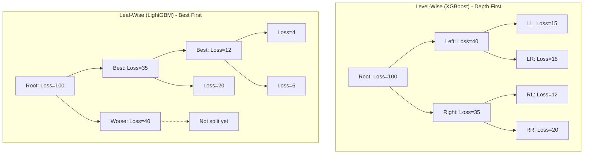
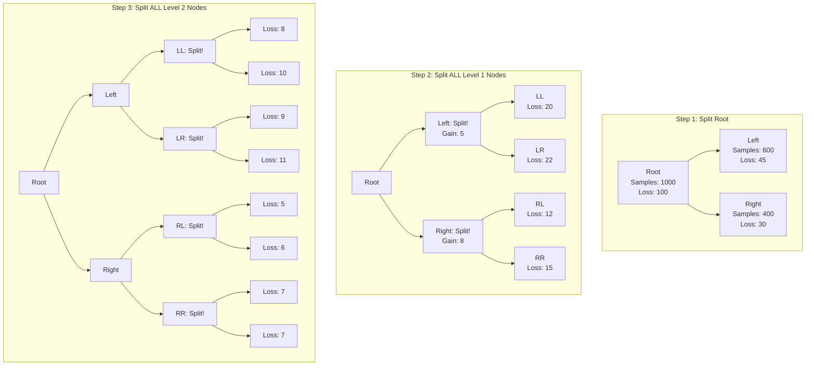
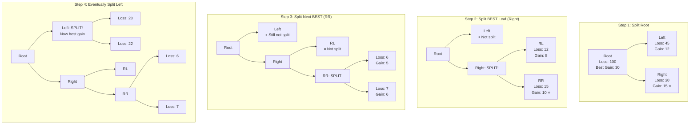
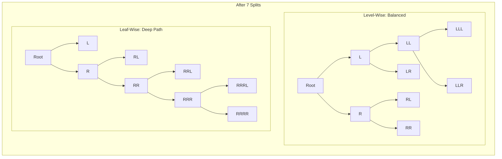
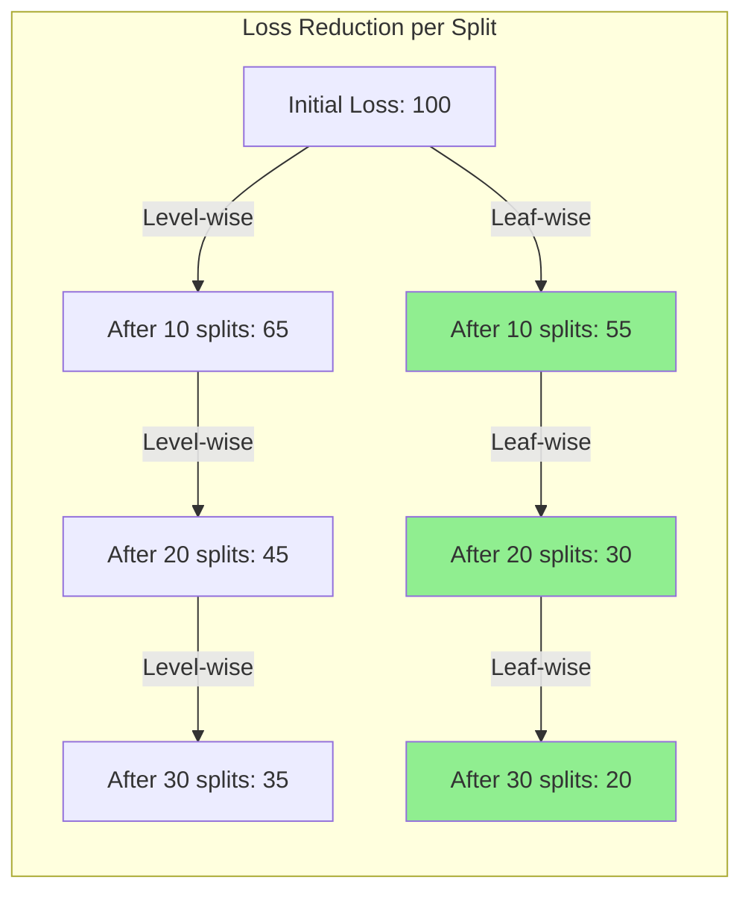

# Gradient Boosting - Complete Guide

## Table of Contents
1. [Introduction](#introduction)
2. [Boosting vs Bagging](#boosting-vs-bagging)
3. [The Boosting Concept](#the-boosting-concept)
4. [AdaBoost](#adaboost)
5. [Gradient Boosting Machines (GBM)](#gradient-boosting-machines-gbm)
6. [XGBoost](#xgboost)
7. [LightGBM](#lightgbm)
8. [CatBoost](#catboost)
9. [Hyperparameters](#hyperparameters)
10. [Practical Examples](#practical-examples)
11. [Comparison](#comparison)

---

## Introduction

**Gradient Boosting** is an ensemble technique that builds models sequentially, where each new model corrects errors made by the previous models.

### Key Difference from Bagging/Random Forest

```
Bagging/Random Forest (Parallel):
  Tree 1 ──┐
  Tree 2 ──┼──→ Average/Vote → Prediction
  Tree 3 ──┘
  (Independent, trained in parallel)

Boosting (Sequential):
  Tree 1 → Tree 2 → Tree 3 → ... → Tree N → Prediction
  (Each tree corrects previous trees' errors)
```

### Core Idea

**Sequential Error Correction**:
1. Start with a weak model
2. Identify where it makes mistakes
3. Build next model to fix those mistakes
4. Repeat
5. Combine all models (weighted sum)

---

## Boosting vs Bagging

| Aspect | Bagging | Boosting |
|--------|---------|----------|
| **Training** | Parallel (independent) | Sequential (dependent) |
| **Goal** | Reduce variance | Reduce bias |
| **Sampling** | Bootstrap (random) | Weighted (focus on errors) |
| **Model weights** | Equal weight | Weighted by performance |
| **Base models** | Deep trees (high variance) | Shallow trees (high bias) |
| **Overfitting** | Resistant | Can overfit if not careful |
| **Speed** | Fast (parallelizable) | Slower (sequential) |
| **Example** | Random Forest | XGBoost, AdaBoost |

### When to Use Each

**Use Bagging/Random Forest when:**
- Want robustness and stability
- Can train in parallel
- Base models have high variance

**Use Boosting when:**
- Want maximum accuracy
- Base models have high bias
- Willing to tune carefully
- Sequential training acceptable

---

## The Boosting Concept

### Intuition: "Wisdom of the Crowd"

Imagine learning to play darts:

```
Round 1: Throw darts → See where you miss → Learn pattern
Round 2: Adjust aim to fix Round 1 errors → Throw → Learn new pattern
Round 3: Adjust aim to fix Round 2 errors → Throw → Learn new pattern
...

Final strategy: Combine all rounds' learned adjustments
```

**Boosting does this with models!**

### The Boosting Framework

```
function BOOSTING(data, n_estimators):
    # Initialize with simple prediction
    F₀(x) = initial_prediction  # e.g., mean for regression

    # Sequentially add models
    for m in 1 to n_estimators:
        # 1. Calculate errors (residuals) of current ensemble
        residuals = y - F_{m-1}(x)

        # 2. Train new model to predict residuals
        h_m(x) = train_model(x, residuals)

        # 3. Add to ensemble (with learning rate)
        F_m(x) = F_{m-1}(x) + η × h_m(x)

    return F_n(x)  # Final ensemble
```

### Key Components

**1. Weak Learners**: Simple models (shallow trees)
- Usually depth 3-6 (vs unlimited for Random Forest)
- High bias, low variance
- Called "stumps" when depth=1

**2. Sequential Training**: Each model focuses on errors
- Not independent like bagging
- Cannot parallelize across trees

**3. Weighted Combination**: Models weighted by performance
- Better models get more weight
- Final prediction = weighted sum

**4. Learning Rate (η)**: Shrinkage parameter
- Controls contribution of each tree
- Lower = more regularization = less overfitting

---

## AdaBoost

**Adaptive Boosting** - The original boosting algorithm

### Algorithm

```
function ADABOOST(data, n_estimators):
    # Initialize sample weights (equal)
    w = [1/N, 1/N, ..., 1/N]  # N samples

    models = []
    alphas = []  # Model weights

    for m in 1 to n_estimators:
        # 1. Train model on weighted data
        h_m = train_model(data, weights=w)

        # 2. Calculate weighted error
        predictions = h_m.predict(X)
        misclassified = (predictions != y)
        err_m = sum(w[misclassified]) / sum(w)

        # 3. Calculate model weight (higher if error is low)
        alpha_m = 0.5 × log((1 - err_m) / err_m)

        # 4. Update sample weights
        # Increase weight for misclassified samples
        # Decrease weight for correct samples
        w = w × exp(-alpha_m × y × predictions)
        w = w / sum(w)  # Normalize

        models.append(h_m)
        alphas.append(alpha_m)

    # Final prediction (weighted vote)
    function PREDICT(x):
        return sign(sum(alpha_m × h_m(x) for m, h_m in enumerate(models)))

    return models, alphas
```

### Step-by-Step Example

**Dataset:**
```python
X = [[1], [2], [3], [4], [5]]
y = [-1, -1, +1, +1, +1]  # Binary classification

Initial weights: [0.2, 0.2, 0.2, 0.2, 0.2]
```

**Round 1:**
```python
# Train stump (depth=1 tree)
Stump 1: Split at X <= 2.5
  Predict: -1 if X <= 2.5, else +1
  Predictions: [-1, -1, +1, +1, +1]
  Errors: None (perfect!)

# Calculate error
err_1 = 0 / 1.0 = 0.0

# Model weight (very high because error is 0)
alpha_1 = 0.5 × log((1-0)/0) → ∞  # In practice, capped

# Update sample weights (all correct, so decrease weights)
# In practice: Next round focuses on harder samples
```

**Round 2:**
```python
# Weights adjusted to focus on "harder" samples near boundary
weights = [0.1, 0.3, 0.3, 0.2, 0.1]  # Higher near decision boundary

# Train new stump
Stump 2: Different split
...
```

**Final Prediction:**
```python
prediction = sign(alpha_1 × stump_1(x) + alpha_2 × stump_2(x) + ...)
```

### Key Properties

**1. Focus on Hard Examples**
- Misclassified samples get higher weight
- Next model focuses on those samples

**2. Model Weighting**
- Better models (lower error) get higher weight
- Worse models (higher error) get lower weight

**3. Exponential Loss**
- AdaBoost minimizes exponential loss
- Can be derived as gradient descent on exponential loss

### Limitations

**1. Sensitive to Noise and Outliers**
- Keeps increasing weights on misclassified samples
- Outliers get huge weights → overfitting

**2. Only for Classification**
- Original AdaBoost for binary classification
- Extensions exist (AdaBoost.R2 for regression)

---

## Gradient Boosting Machines (GBM)

**Generalization of boosting using gradient descent**

### Core Insight

**AdaBoost**: Special case of gradient boosting with exponential loss

**GBM**: Works with ANY differentiable loss function
- Regression: MSE, MAE, Huber loss
- Classification: Log loss (logistic)
- Custom loss functions possible

### The Gradient Boosting Algorithm

```
function GRADIENT_BOOSTING(data, loss_function, n_estimators, learning_rate):
    # 1. Initialize with constant prediction
    F₀(x) = argmin_c Σ loss(y_i, c)
    # For MSE: F₀(x) = mean(y)
    # For log loss: F₀(x) = log(odds)

    # 2. Sequentially add trees
    for m in 1 to n_estimators:
        # 2a. Calculate pseudo-residuals (negative gradient)
        r_im = -∂loss(y_i, F_{m-1}(x_i)) / ∂F_{m-1}(x_i)

        # 2b. Fit tree to pseudo-residuals
        h_m(x) = train_tree(x, r_im)

        # 2c. Find optimal step size (line search)
        γ_m = argmin_γ Σ loss(y_i, F_{m-1}(x_i) + γ × h_m(x_i))

        # 2d. Update ensemble
        F_m(x) = F_{m-1}(x) + learning_rate × γ_m × h_m(x)

    return F_n(x)
```

### Why "Gradient" Boosting?

**Key insight**: Residuals = Negative gradient of loss function!

**For MSE (regression):**
```
Loss = (1/2) × (y - F(x))²

∂Loss/∂F(x) = -(y - F(x)) = -residual

Negative gradient = y - F(x) = residual
```

**So fitting to residuals = gradient descent in function space!**

### Regression Example (MSE)

**Dataset:**
```python
X = [[1], [2], [3], [4], [5]]
y = [2.0, 4.0, 6.0, 8.0, 10.0]

learning_rate = 0.1
```

**Iteration 0:**
```python
# Initialize with mean
F₀(x) = mean(y) = 6.0

Predictions: [6.0, 6.0, 6.0, 6.0, 6.0]
Residuals: [-4.0, -2.0, 0.0, 2.0, 4.0]
```

**Iteration 1:**
```python
# Train tree to predict residuals
Tree₁: Learns to predict [-4.0, -2.0, 0.0, 2.0, 4.0]

# Update predictions
F₁(x) = F₀(x) + 0.1 × Tree₁(x)
      = 6.0 + 0.1 × residual_prediction

New predictions: [5.6, 5.8, 6.0, 6.2, 6.4]
New residuals: [-3.6, -1.8, 0.0, 1.8, 3.6]
```

**Iteration 2:**
```python
# Train tree to predict new residuals
Tree₂: Learns to predict [-3.6, -1.8, 0.0, 1.8, 3.6]

# Update predictions
F₂(x) = F₁(x) + 0.1 × Tree₂(x)

New predictions: [5.24, 5.64, 6.0, 6.36, 6.76]
New residuals: [-3.24, -1.64, 0.0, 1.64, 3.24]
```

**Continue until convergence or max iterations...**

### Classification (Log Loss)

**For binary classification:**
```python
# Convert to probabilities using logistic function
p(x) = 1 / (1 + exp(-F(x)))

# Log loss
Loss = -[y × log(p) + (1-y) × log(1-p)]

# Gradient
∂Loss/∂F(x) = -(y - p(x)) = -residual

# So residuals = y - p(x) (difference between true and predicted probability)
```

### Learning Rate (Shrinkage)

**Purpose**: Regularization to prevent overfitting

```python
F_m(x) = F_{m-1}(x) + η × h_m(x)
         ↑               ↑
    Previous model   Learning rate
```

**Effect:**
- **η = 1.0**: No shrinkage (aggressive, may overfit)
- **η = 0.1**: Moderate shrinkage (common)
- **η = 0.01**: Strong shrinkage (needs more trees)

**Trade-off:**
- Lower η → More trees needed → Slower training
- Lower η → Better generalization → Less overfitting

**Typical values**: 0.01 - 0.3

---

## XGBoost

**eXtreme Gradient Boosting** - Optimized, efficient, and powerful implementation

### Key Innovations

**1. Regularized Objective Function**

```
Objective = Σ loss(y_i, ŷ_i) + Σ Ω(f_k)
            ↑                   ↑
        Training loss      Regularization

Where:
Ω(f_k) = γT + (λ/2) × Σ w_j²
         ↑            ↑
    #leaves penalty   L2 on leaf weights
```

**Benefits:**
- Penalizes complex trees
- L1 and L2 regularization on leaf weights
- Prevents overfitting

**2. Second-Order Optimization**

Uses **second-order Taylor expansion** (Newton's method):

```
Traditional GBM: Uses first derivative (gradient)
Loss ≈ L(y, F) + g × h(x)
       ↑         ↑
    Current    1st derivative

XGBoost: Uses first AND second derivatives
Loss ≈ L(y, F) + g × h(x) + (1/2) × h × h(x)²
       ↑         ↑           ↑
    Current    1st der.    2nd der. (Hessian)
```

**Benefits:**
- Faster convergence
- More accurate step sizes
- Better handling of loss functions

**3. Sparsity-Aware Split Finding**

Learns best direction for missing values:

```
For each split:
  - Try sending missing values left
  - Try sending missing values right
  - Choose direction that improves loss most
```

**Benefits:**
- Handles missing data naturally
- No need for imputation
- Fast sparse matrix operations

**4. Parallel and Distributed Computing**

- Parallelizes tree construction (not across trees, but within each tree)
- Block structure for efficient sorting
- Cache-aware access patterns
- Distributed training across machines

**5. Tree Pruning**

Uses **max_depth** first, then prunes backward:

```
Regular GBM:
  - Grows tree depth-by-depth
  - Stops when no gain

XGBoost:
  - Grows to max_depth
  - Prunes backward (removes splits with negative gain)
  - Can recover from early negative splits
```

**6. Built-in Cross-Validation**

```python
xgb.cv(params, dtrain, num_boost_round=100, nfold=5)
```

### XGBoost Algorithm (Simplified)

```
function XGBOOST(data, params):
    # Initialize
    F₀(x) = initial_prediction

    for m in 1 to n_estimators:
        # 1. Calculate gradients and hessians
        g_i = ∂loss(y_i, F_{m-1}(x_i)) / ∂F
        h_i = ∂²loss(y_i, F_{m-1}(x_i)) / ∂F²

        # 2. Build tree using gradients and hessians
        tree_m = build_tree(X, g, h, params)

        # 3. Update ensemble
        F_m(x) = F_{m-1}(x) + learning_rate × tree_m(x)

    return F_n(x)

function BUILD_TREE(X, g, h, depth=0):
    if depth >= max_depth or min_samples:
        # Leaf value using second-order optimization
        weight = -sum(g) / (sum(h) + λ)
        return LEAF(weight)

    # Find best split
    best_gain = -∞
    for feature in features:
        for threshold in sorted(unique_values):
            # Split data
            left_idx = X[:, feature] <= threshold
            right_idx = ~left_idx

            # Calculate gain using second-order formula
            gain = (sum(g[left])² / (sum(h[left]) + λ) +
                    sum(g[right])² / (sum(h[right]) + λ) -
                    sum(g)² / (sum(h) + λ)) - γ
                    ↑
                Regularization penalty

            if gain > best_gain:
                best_gain = gain
                best_split = (feature, threshold)

    # Recursive split
    left_child = BUILD_TREE(X[left_idx], g[left_idx], h[left_idx], depth+1)
    right_child = BUILD_TREE(X[right_idx], g[right_idx], h[right_idx], depth+1)

    return NODE(feature, threshold, left_child, right_child)
```

### XGBoost Hyperparameters

**Tree Parameters:**
```python
params = {
    'max_depth': 6,           # Maximum tree depth
    'min_child_weight': 1,    # Minimum sum of hessian in child
    'gamma': 0,               # Minimum loss reduction for split
    'subsample': 1.0,         # Row sampling ratio
    'colsample_bytree': 1.0,  # Column sampling per tree
    'colsample_bylevel': 1.0, # Column sampling per level
    'colsample_bynode': 1.0,  # Column sampling per split
}
```

**Regularization Parameters:**
```python
params = {
    'lambda': 1,     # L2 regularization (default)
    'alpha': 0,      # L1 regularization
    'eta': 0.3,      # Learning rate (same as learning_rate)
}
```

**Learning Parameters:**
```python
params = {
    'objective': 'binary:logistic',  # Loss function
    'eval_metric': 'auc',            # Evaluation metric
    'seed': 42,                       # Random seed
}
```

---

## LightGBM

**Light Gradient Boosting Machine** - Microsoft's super-fast implementation

### Key Innovations

**1. Histogram-Based Split Finding**

Instead of sorting all values:
```python
Traditional GBM:
  For feature with 10,000 unique values:
    - Sort all values: O(n log n)
    - Try all splits: O(n)

LightGBM:
  - Bin values into 255 buckets (histogram)
  - Try only 255 splits: O(255)
  - Much faster!
```

**2. Gradient-Based One-Side Sampling (GOSS)**

**Idea**: Not all samples are equally important

```python
# Samples with large gradients are more important
# Keep all large-gradient samples
# Randomly sample small-gradient samples

large_gradient_samples = top_a_percent(samples, by=gradient)
small_gradient_samples = random_sample(remaining, size=b_percent)

# Compensate small gradient samples with weights
weight_multiplier = (1 - a) / b

# This reduces data size while maintaining accuracy!
```

**3. Exclusive Feature Bundling (EFB)**

**Idea**: Bundle mutually exclusive features (sparse features)

```python
# Features that are never non-zero together can share a bin
# Common in categorical data with one-hot encoding

Feature A: [1, 0, 0, 1, 0]
Feature B: [0, 1, 0, 0, 1]
# Never both non-zero → can bundle!

Bundled: [1, 2, 0, 1, 2]  # Use different values
# Reduces #features → faster training
```

**4. Leaf-Wise (Best-First) Growth**

LightGBM uses a fundamentally different tree growing strategy than XGBoost.

**Level-Wise Growth (XGBoost)**:
- Grows all nodes at the same level before moving to next level
- Ensures balanced tree structure
- May split nodes that don't improve loss much

**Leaf-Wise Growth (LightGBM)**:
- Grows the leaf that maximally reduces loss
- Can create unbalanced but more accurate trees
- More efficient loss reduction per split



### Detailed Comparison: Tree Growing Strategies

#### Level-Wise (Depth-First) - XGBoost

**Algorithm:**
```
For depth = 0 to max_depth:
    For each leaf at current depth:
        Find best split for this leaf
        Create left and right children
    Move to next depth level
```

**Step-by-Step Example:**



**Characteristics:**
- **Order of splits**: Left-to-right at each level
- **All nodes at level d split before any node at level d+1**
- **Balanced tree**: All branches have similar depth
- **May waste splits**: Some nodes split even if gain is small

#### Leaf-Wise (Best-First) - LightGBM

**Algorithm:**
```
For iteration = 1 to num_leaves:
    Find leaf with maximum loss reduction potential
    Split ONLY that leaf
    Update candidates with new leaves
```

**Step-by-Step Example:**



**Characteristics:**
- **Order of splits**: By loss reduction (best first)
- **Unbalanced tree**: Some branches much deeper than others
- **No wasted splits**: Only split if gain is substantial
- **More efficient**: Achieves lower loss with fewer splits

### Visual Comparison: Same Number of Splits



### Implications and Trade-offs

#### Level-Wise (XGBoost)

**Pros:**
- ✓ **Balanced trees**: Easier to interpret
- ✓ **Less overfitting**: Depth limit naturally regularizes
- ✓ **Stable**: Similar performance across different datasets
- ✓ **Predictable memory**: Known max depth

**Cons:**
- ✗ **Inefficient**: May split low-gain nodes
- ✗ **Slower convergence**: Needs more trees for same accuracy
- ✗ **Wasted computation**: Splits that don't help much

**Example Scenario:**
```python
# Dataset with one strong feature and many weak features

Level-wise approach:
  Split 1: Strong feature (Gain: 50) ✓
  Split 2: Weak feature left (Gain: 2) ✗ Wasted
  Split 3: Weak feature right (Gain: 3) ✗ Wasted
  Split 4: Strong feature (Gain: 20) ✓
  ...
  # Many splits wasted on weak branches
```

#### Leaf-Wise (LightGBM)

**Pros:**
- ✓ **Efficient**: Only splits where it matters most
- ✓ **Faster convergence**: Achieves lower loss quicker
- ✓ **Better accuracy**: With same number of splits
- ✓ **Flexible**: Can create complex patterns where needed

**Cons:**
- ✗ **Overfitting risk**: Can create very deep branches
- ✗ **Unbalanced**: Some branches much deeper than others
- ✗ **Sensitive**: Needs careful `num_leaves` and `min_data_in_leaf` tuning
- ✗ **Less predictable**: Hard to estimate tree depth

**Example Scenario:**
```python
# Same dataset with one strong feature

Leaf-wise approach:
  Split 1: Strong feature (Gain: 50) ✓
  Split 2: Strong feature again (Gain: 20) ✓
  Split 3: Strong feature refined (Gain: 15) ✓
  Split 4: Strong feature refined (Gain: 10) ✓
  ...
  # All splits focused on informative patterns
```

### When Each Strategy Excels

#### Use Level-Wise (XGBoost) When:

1. **Small-medium datasets** (< 10K samples)
   - Overfitting is main concern
   - Balanced trees more robust

2. **Many noisy features**
   - Don't want to dig too deep into noise
   - Depth limit provides good regularization

3. **Interpretability matters**
   - Balanced trees easier to understand
   - Similar depth across branches

4. **Conservative approach preferred**
   - Stable, predictable performance
   - Less hyperparameter sensitivity

#### Use Leaf-Wise (LightGBM) When:

1. **Large datasets** (> 100K samples)
   - Efficiency gains are substantial
   - Less overfitting risk with more data

2. **Clear signal in data**
   - Strong features benefit from deeper exploration
   - Complex interactions to capture

3. **Speed is critical**
   - Faster training for same accuracy
   - Or better accuracy for same time

4. **Willing to tune carefully**
   - Set `num_leaves` carefully
   - Use `min_data_in_leaf` regularization
   - Monitor overfitting

### Practical Parameter Settings

#### XGBoost (Level-Wise)
```python
# Conservative (less overfitting)
params = {
    'max_depth': 3,           # Shallow trees
    'min_child_weight': 5,    # Minimum samples per leaf
    'subsample': 0.8,         # Row sampling
    'colsample_bytree': 0.8   # Feature sampling
}

# Balanced
params = {
    'max_depth': 6,           # Standard depth
    'min_child_weight': 1,
    'subsample': 0.8,
    'colsample_bytree': 0.8
}

# Aggressive (more capacity)
params = {
    'max_depth': 10,          # Deep trees
    'min_child_weight': 1,
    'subsample': 1.0,
    'colsample_bytree': 1.0
}
```

#### LightGBM (Leaf-Wise)
```python
# Conservative (less overfitting)
params = {
    'num_leaves': 31,         # 2^5 - 1 (max_depth ≈ 5)
    'min_data_in_leaf': 20,   # Minimum samples per leaf
    'max_depth': 5,           # Limit depth explicitly
    'subsample': 0.8
}

# Balanced
params = {
    'num_leaves': 63,         # 2^6 - 1 (max_depth ≈ 6)
    'min_data_in_leaf': 10,
    'max_depth': -1,          # No depth limit
    'subsample': 0.8
}

# Aggressive (more capacity)
params = {
    'num_leaves': 255,        # 2^8 - 1 (max_depth ≈ 8)
    'min_data_in_leaf': 5,
    'max_depth': -1,
    'subsample': 1.0
}

# IMPORTANT: num_leaves should be < 2^max_depth
# Too many leaves with low max_depth → overfitting
```

### Real-World Performance Comparison

```python
# Typical results on large dataset (1M samples)

XGBoost (Level-wise):
  Training time: 100 seconds
  Trees needed: 500
  Final accuracy: 0.850
  Tree depth: Balanced (avg 6, max 8)

LightGBM (Leaf-wise):
  Training time: 30 seconds (3× faster!)
  Trees needed: 300
  Final accuracy: 0.855 (slightly better)
  Tree depth: Unbalanced (avg 8, max 15)
```

### Visualization: Loss Reduction Efficiency



**Key Insight**: Leaf-wise (green) achieves lower loss with same number of splits, but risks overfitting if not regularized properly.

**Benefits:**
- ✓ More efficient loss reduction per split
- ✓ Better accuracy with same number of trees
- ✓ Faster training on large datasets

**Risks:**
- ✗ Can overfit more easily (very deep branches)
- ✗ Need careful tuning of `num_leaves` and `min_data_in_leaf`
- ✗ Less predictable tree structure

### LightGBM vs XGBoost

| Aspect | XGBoost | LightGBM |
|--------|---------|----------|
| **Speed** | Fast | Very fast (3-20× faster) |
| **Memory** | Moderate | Low |
| **Accuracy** | High | Similar/slightly better |
| **Tree growth** | Level-wise | Leaf-wise |
| **Categorical** | Need encoding | Native support |
| **Large datasets** | Good | Excellent |
| **Small datasets** | Better | May overfit |

---

## CatBoost

**Categorical Boosting** - Yandex's implementation with focus on categorical features

### Key Innovations

**1. Ordered Target Statistics**

**Problem**: Target leakage in categorical encoding

```python
# Traditional mean encoding (LEAKS!)
feature = ['A', 'A', 'B', 'B', 'A']
target =  [ 1,   0,   1,   0,   1 ]

# Encode 'A' as mean of all 'A' targets
encoded['A'] = (1 + 0 + 1) / 3 = 0.667

# But this uses information from ALL samples!
# Sample 0 sees targets from samples 1 and 4 → leakage
```

**CatBoost Solution**: Use only **previous** samples

```python
# Ordered Target Statistics (no leakage)
Random permutation: [2, 4, 0, 1, 3]

For sample at position 0 (feature='A'):
  Prior samples with 'A': none
  Encoded value: prior (e.g., 0.5)

For sample at position 1 (feature='A'):
  Prior samples with 'A': none (position 0 is 'B')
  Encoded value: prior (0.5)

For sample at position 2 (feature='B'):
  Prior samples with 'B': sample at position 0
  Encoded value: 1.0

For sample at position 3 (feature='A'):
  Prior samples with 'A': sample at position 1
  Encoded value: 1.0
...
```

**Benefits:**
- No target leakage
- Better generalization
- Multiple random permutations for robustness

**2. Ordered Boosting**

Prevents prediction shift:

```python
# Problem in standard gradient boosting:
# Calculate residuals using ALL data
# Train tree using ALL data
# → Overfitting

# CatBoost solution:
# Use different data for residuals and training
# Via random permutations
```

**3. Native Categorical Feature Support**

```python
# No need for one-hot or label encoding!
cat_features = [0, 2, 5]  # Indices of categorical features

model = CatBoostClassifier(cat_features=cat_features)
model.fit(X, y)  # X can have string categories directly
```

**4. Robust to Overfitting**

Multiple strategies:
- Ordered boosting
- Ordered target statistics
- Random permutations
- Built-in regularization

### CatBoost vs XGBoost vs LightGBM

| Feature | XGBoost | LightGBM | CatBoost |
|---------|---------|----------|----------|
| **Speed** | Fast | Very fast | Moderate |
| **Categorical** | Manual encoding | Limited support | Excellent |
| **Overfitting** | Can overfit | Can overfit | Very robust |
| **Tuning** | Needs tuning | Needs tuning | Good defaults |
| **GPU** | Yes | Yes | Yes |
| **Small data** | Good | Can overfit | Best |

---

## Hyperparameters

### Common Hyperparameters (All Boosting Algorithms)

**1. n_estimators / num_boost_round**

Number of boosting iterations (trees)

```python
# Too few: underfitting
model = XGBClassifier(n_estimators=10)

# Good balance
model = XGBClassifier(n_estimators=100)

# Many (with early stopping)
model = XGBClassifier(n_estimators=1000)
```

**Effect:**
- More trees → better training performance
- Risk of overfitting if too many
- Use early stopping to find optimal number

**Typical values**: 100-1000

**2. learning_rate / eta**

Step size shrinkage

```python
# Fast learning (may overfit)
model = XGBClassifier(learning_rate=0.3)

# Moderate
model = XGBClassifier(learning_rate=0.1)

# Slow learning (needs more trees, more robust)
model = XGBClassifier(learning_rate=0.01, n_estimators=1000)
```

**Effect:**
- Lower → more trees needed, but better generalization
- Higher → fewer trees, but may overfit

**Typical values**: 0.01-0.3

**Rule of thumb**: `n_estimators × learning_rate ≈ constant`

**3. max_depth**

Maximum tree depth

```python
# Shallow (less overfitting)
model = XGBClassifier(max_depth=3)

# Moderate (common)
model = XGBClassifier(max_depth=6)

# Deep (may overfit)
model = XGBClassifier(max_depth=10)
```

**Effect:**
- Deeper → more complex interactions, but overfitting risk
- Shallower → simpler, more robust

**Typical values**: 3-10 (vs unlimited for Random Forest!)

**4. subsample**

Fraction of samples to use per tree

```python
# Use all samples
model = XGBClassifier(subsample=1.0)

# Use 80% (stochastic gradient boosting)
model = XGBClassifier(subsample=0.8)

# Use 50%
model = XGBClassifier(subsample=0.5)
```

**Effect:**
- < 1.0 → adds randomness, reduces overfitting
- Faster training
- Similar to bagging's bootstrap

**Typical values**: 0.8-1.0

**5. colsample_bytree / colsample_bylevel**

Fraction of features to use

```python
# Use all features per tree
model = XGBClassifier(colsample_bytree=1.0)

# Use 80% features per tree (similar to Random Forest)
model = XGBClassifier(colsample_bytree=0.8)

# Use 50% features per level
model = XGBClassifier(colsample_bylevel=0.5)
```

**Effect:**
- < 1.0 → reduces correlation, like Random Forest
- Prevents single feature from dominating

**Typical values**: 0.8-1.0

### XGBoost-Specific Hyperparameters

**6. gamma**

Minimum loss reduction for split

```python
model = XGBClassifier(gamma=0)    # No constraint
model = XGBClassifier(gamma=1)    # Conservative
model = XGBClassifier(gamma=5)    # Very conservative
```

**Effect:** Higher → fewer splits → simpler trees

**7. lambda / alpha**

L2 / L1 regularization on leaf weights

```python
model = XGBClassifier(
    reg_lambda=1,    # L2 (default)
    reg_alpha=0      # L1 (default)
)

# Strong regularization
model = XGBClassifier(
    reg_lambda=10,
    reg_alpha=1
)
```

**8. scale_pos_weight**

Balance for imbalanced datasets

```python
# For imbalanced classes
neg_samples = sum(y == 0)
pos_samples = sum(y == 1)
scale = neg_samples / pos_samples

model = XGBClassifier(scale_pos_weight=scale)
```

### LightGBM-Specific Hyperparameters

**9. num_leaves**

Maximum number of leaves (used instead of max_depth)

```python
# Simple trees
model = lgb.LGBMClassifier(num_leaves=31)  # Default (2^5 - 1)

# Complex trees
model = lgb.LGBMClassifier(num_leaves=127)  # 2^7 - 1

# Rule of thumb: num_leaves < 2^max_depth
```

**10. min_data_in_leaf**

Minimum samples in leaf

```python
model = lgb.LGBMClassifier(min_data_in_leaf=20)
```

**Effect:** Prevents overfitting, especially with leaf-wise growth

### Hyperparameter Tuning Strategy

**1. Start with Defaults**
```python
model = XGBClassifier()
```

**2. Tune Tree Complexity**
```python
param_grid = {
    'max_depth': [3, 5, 7],
    'min_child_weight': [1, 3, 5]
}
```

**3. Tune Regularization**
```python
param_grid = {
    'gamma': [0, 1, 5],
    'reg_lambda': [1, 10, 100],
    'subsample': [0.8, 0.9, 1.0],
    'colsample_bytree': [0.8, 0.9, 1.0]
}
```

**4. Tune Learning Rate and n_estimators**
```python
# Use early stopping
model = XGBClassifier(
    learning_rate=0.01,
    n_estimators=10000,
    early_stopping_rounds=50
)
model.fit(X_train, y_train, eval_set=[(X_val, y_val)])
```

---

## Practical Examples

### XGBoost Classification

```python
import xgboost as xgb
from sklearn.datasets import make_classification
from sklearn.model_selection import train_test_split

# Generate dataset
X, y = make_classification(
    n_samples=1000,
    n_features=20,
    n_informative=15,
    n_redundant=5,
    random_state=42
)

X_train, X_test, y_train, y_test = train_test_split(
    X, y, test_size=0.2, random_state=42
)

# XGBoost Classifier
model = xgb.XGBClassifier(
    n_estimators=100,
    max_depth=5,
    learning_rate=0.1,
    subsample=0.8,
    colsample_bytree=0.8,
    objective='binary:logistic',
    eval_metric='auc',
    random_state=42
)

# Train with early stopping
model.fit(
    X_train, y_train,
    eval_set=[(X_val, y_val)],
    early_stopping_rounds=10,
    verbose=False
)

# Evaluate
train_score = model.score(X_train, y_train)
test_score = model.score(X_test, y_test)
print(f"Train Accuracy: {train_score:.3f}")
print(f"Test Accuracy: {test_score:.3f}")

# Feature importance
import matplotlib.pyplot as plt
xgb.plot_importance(model)
plt.show()

# Predictions
y_pred = model.predict(X_test)
y_proba = model.predict_proba(X_test)
```

### XGBoost Regression

```python
from sklearn.datasets import make_regression
from sklearn.metrics import mean_squared_error, r2_score

# Generate dataset
X, y = make_regression(
    n_samples=1000,
    n_features=10,
    noise=10,
    random_state=42
)

X_train, X_test, y_train, y_test = train_test_split(
    X, y, test_size=0.2, random_state=42
)

# XGBoost Regressor
model = xgb.XGBRegressor(
    n_estimators=100,
    max_depth=5,
    learning_rate=0.1,
    subsample=0.8,
    colsample_bytree=0.8,
    objective='reg:squarederror',
    random_state=42
)

# Train
model.fit(X_train, y_train)

# Predict
y_pred = model.predict(X_test)

# Evaluate
mse = mean_squared_error(y_test, y_pred)
r2 = r2_score(y_test, y_pred)
print(f"MSE: {mse:.2f}")
print(f"R²: {r2:.3f}")
```

### LightGBM with Categorical Features

```python
import lightgbm as lgb
import pandas as pd

# Dataset with categorical features
df = pd.DataFrame({
    'feature1': [1.0, 2.0, 3.0, 4.0, 5.0],
    'feature2': ['A', 'B', 'A', 'B', 'C'],
    'feature3': ['X', 'Y', 'X', 'Y', 'Z'],
    'target': [0, 1, 0, 1, 1]
})

X = df[['feature1', 'feature2', 'feature3']]
y = df['target']

# LightGBM handles categorical features directly
model = lgb.LGBMClassifier(
    n_estimators=100,
    num_leaves=31,
    learning_rate=0.1,
    random_state=42
)

# Specify categorical features
model.fit(
    X, y,
    categorical_feature=['feature2', 'feature3']
)

# Or use category dtype
X['feature2'] = X['feature2'].astype('category')
X['feature3'] = X['feature3'].astype('category')
model.fit(X, y)  # Auto-detects categorical
```

### CatBoost with Native Categorical Support

```python
from catboost import CatBoostClassifier
import pandas as pd

# Dataset with categorical features (as strings!)
df = pd.DataFrame({
    'numeric1': [1.0, 2.0, 3.0, 4.0, 5.0],
    'category1': ['A', 'B', 'A', 'B', 'C'],
    'category2': ['X', 'Y', 'X', 'Y', 'Z'],
    'target': [0, 1, 0, 1, 1]
})

X = df[['numeric1', 'category1', 'category2']]
y = df['target']

# CatBoost - no encoding needed!
model = CatBoostClassifier(
    iterations=100,
    depth=5,
    learning_rate=0.1,
    cat_features=[1, 2],  # Indices of categorical columns
    verbose=False,
    random_state=42
)

model.fit(X, y)

# Works with string categories directly!
predictions = model.predict(['A', 'X'])
```

### Early Stopping Example

```python
import xgboost as xgb

X_train, X_val, y_train, y_val = train_test_split(
    X_train_full, y_train_full, test_size=0.2
)

model = xgb.XGBClassifier(
    n_estimators=1000,      # Set high
    learning_rate=0.01,     # Set low
    early_stopping_rounds=50  # Stop if no improvement for 50 rounds
)

model.fit(
    X_train, y_train,
    eval_set=[(X_train, y_train), (X_val, y_val)],
    eval_metric='auc',
    verbose=True
)

# Get best iteration
print(f"Best iteration: {model.best_iteration}")
print(f"Best score: {model.best_score}")

# Model automatically uses best iteration for predictions
```

---

## Comparison

### Performance Comparison

| Algorithm | Accuracy | Speed | Memory | Ease of Use |
|-----------|----------|-------|--------|-------------|
| **GBM (sklearn)** | Good | Slow | High | Easy |
| **XGBoost** | Excellent | Fast | Moderate | Moderate |
| **LightGBM** | Excellent | Very Fast | Low | Moderate |
| **CatBoost** | Excellent | Moderate | Moderate | Easy |

### When to Use Each

**XGBoost**:
- ✓ General purpose, most popular
- ✓ Good documentation and community
- ✓ Proven track record (Kaggle winner)
- ✓ Robust to overfitting with proper tuning

**LightGBM**:
- ✓ Very large datasets (millions of samples)
- ✓ Need fast training
- ✓ Limited memory
- ✗ Small datasets (may overfit)

**CatBoost**:
- ✓ Many categorical features
- ✓ Small-medium datasets
- ✓ Want good defaults (less tuning)
- ✓ Robust to overfitting

**Sklearn GBM**:
- ✓ Simple use cases
- ✓ No installation dependencies
- ✗ Large datasets (too slow)

### Boosting vs Random Forest

| Aspect | Random Forest | Gradient Boosting |
|--------|---------------|-------------------|
| **Accuracy** | Good | Better |
| **Speed (training)** | Fast (parallel) | Slower (sequential) |
| **Speed (prediction)** | Fast | Fast |
| **Overfitting** | Hard to overfit | Easy to overfit |
| **Tuning** | Minimal tuning | Careful tuning needed |
| **Robustness** | Very robust | Sensitive to outliers |
| **Interpretability** | Low | Low |

**Rule of thumb:**
- Start with Random Forest (robust, fast, good defaults)
- If need more accuracy, switch to XGBoost/LightGBM (but tune carefully!)

---

## Key Takeaways

1. **Boosting = Sequential Error Correction**
   - Each model corrects previous models' errors
   - Weighted combination of weak learners

2. **Reduces Bias (vs Bagging Reduces Variance)**
   - Uses shallow trees (high bias, low variance)
   - Sequential training reduces bias

3. **Three Main Paradigms**
   - AdaBoost: Reweight samples
   - GBM: Fit residuals (gradient descent)
   - Modern: XGBoost/LightGBM/CatBoost (optimized GBM)

4. **Key Hyperparameters**
   - `n_estimators`: Number of trees (use early stopping)
   - `learning_rate`: Shrinkage (lower = more robust)
   - `max_depth`: Tree complexity (3-10, not unlimited!)
   - `subsample`, `colsample_bytree`: Randomness (regularization)

5. **XGBoost Innovations**
   - Second-order optimization (Newton's method)
   - Regularized objective
   - Parallel processing
   - Sparsity-aware

6. **LightGBM Innovations**
   - Histogram-based splitting (speed)
   - Leaf-wise growth (accuracy)
   - GOSS and EFB (efficiency)

7. **CatBoost Innovations**
   - Ordered target statistics (no leakage)
   - Native categorical support
   - Robust to overfitting

8. **Best Practices**
   - Use early stopping
   - Monitor train vs validation error
   - Start with Random Forest, then try boosting
   - Use cross-validation for tuning
   - Watch for overfitting (unlike Random Forest!)

9. **When to Use Boosting**
   - ✓ Want maximum accuracy
   - ✓ Willing to tune carefully
   - ✓ Have computational resources
   - ✗ Need interpretability
   - ✗ Have noisy data with outliers

---

## Further Reading

- **Original Papers**:
  - Freund & Schapire (1997) "A Decision-Theoretic Generalization of On-Line Learning"
  - Friedman (2001) "Greedy Function Approximation: A Gradient Boosting Machine"
  - Chen & Guestrin (2016) "XGBoost: A Scalable Tree Boosting System"

- **Documentation**:
  - XGBoost: https://xgboost.readthedocs.io/
  - LightGBM: https://lightgbm.readthedocs.io/
  - CatBoost: https://catboost.ai/

- **Theory**:
  - "The Elements of Statistical Learning" - Chapter 10 (Boosting)
  - "Gradient Boosting from Theory to Practice"

- **Applications**:
  - Kaggle competitions (boosting dominates)
  - Production ML systems
  - Feature engineering with boosting
